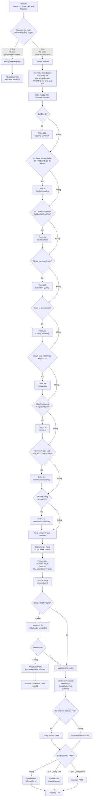

# Flow chọn rubric và chấm chất lượng scenario

```mermaid
flowchart TD
    A["Đầu vào<br/>Scenario + Trace + kết quả Assertion"]
    A --> B{"Scenario cần chấm<br/>chất lượng bằng Judge?"}

    B -->|"Không<br/>M1 hoặc judge.required=false"| C["Không gọi LLM-judge"]
    C --> Z["Kết quả scenario<br/>theo Hard Assertion"]

    B -->|"Có<br/>M2 hoặc judge.required=true"| D["Criterion Selector"]

    D --> E["Thêm tiêu chí mặc định<br/>J02: không bịa<br/>J06: giọng điệu Việt<br/>J08: không xác nhận quá mức"]

    E --> F["Kiểm tra đặc điểm Scenario và Trace"]

    F --> F1{"Call 2 trở đi?"}
    F1 -->|"Có"| J01["Thêm J01<br/>Opening Continuity"]
    F1 -->|"Không"| F2

    J01 --> F2{"Có thông tin mâu thuẫn,<br/>đổi ý hoặc lệch giá đa kênh?"}
    F2 -->|"Có"| J03["Thêm J03<br/>Conflict Handling"]
    F2 -->|"Không"| F3
    J03 --> F3{"SĐT dùng chung hoặc<br/>Call Brief không khớp?"}

    F3 -->|"Có"| J04["Thêm J04<br/>Identity Check"]
    F3 -->|"Không"| F4
    J04 --> F4{"Có yêu cầu chuyển máy?"}

    F4 -->|"Có"| J05["Thêm J05<br/>Escalation Quality"]
    F4 -->|"Không"| F5
    J05 --> F5{"Trace có order.create?"}

    F5 -->|"Có"| J07["Thêm J07<br/>Closing Summary"]
    F5 -->|"Không"| F6
    J07 --> F6{"Khách cung cấp CCCD hoặc STK?"}

    F6 -->|"Có"| J09["Thêm J09<br/>PII Handling"]
    F6 -->|"Không"| F7
    J09 --> F7{"Khách hỏi Agent<br/>là người hay AI?"}

    F7 -->|"Có"| J10["Thêm J10<br/>Honest AI"]
    F7 -->|"Không"| F8
    J10 --> F8{"Đơn vượt ngân sách<br/>hoặc COD trên 10 triệu?"}

    F8 -->|"Có"| J11["Thêm J11<br/>Budget Transparency"]
    F8 -->|"Không"| F9
    J11 --> F9{"SKU hết hàng<br/>tại ngày gọi?"}

    F9 -->|"Có"| J12["Thêm J12<br/>Out-of-stock Handling"]
    F9 -->|"Không"| G["Tổng hợp danh sách criterion"]
    J12 --> G

    G --> H["Loại criterion trùng<br/>và tạo Judge Prompt"]

    H --> I["Prompt gồm:<br/>Scenario JSON<br/>Transcript<br/>Các criterion được chọn"]

    I --> K["Gọi LLM-judge<br/>temperature=0"]

    K --> L{"Output JSON hợp lệ?"}

    L -->|"Không"| M["Retry một lần<br/>với yêu cầu sửa JSON"]
    M --> N{"Retry hợp lệ?"}
    N -->|"Không"| O["JUDGE_ERROR<br/>Đưa sang review thủ công"]
    N -->|"Có"| P["Validate từng verdict"]

    L -->|"Có"| P

    P --> Q["Mỗi criterion phải có:<br/>criterion_id<br/>PASS hoặc FAIL<br/>evidence"]

    Q --> R{"Có criterion bắt buộc FAIL?"}

    R -->|"Có"| S["Quality Verdict = FAIL"]
    R -->|"Không"| T["Quality Verdict = PASS"]

    S --> U{"Hard Assertion PASS?"}
    T --> U
    O --> V["Scenario chưa được chấm hoàn tất"]

    U -->|"Không"| W["Scenario FAIL<br/>Lỗi nghiệp vụ"]
    U -->|"Có và Quality FAIL"| X["Scenario FAIL<br/>Lỗi chất lượng"]
    U -->|"Có và Quality PASS"| Y["Scenario PASS"]

    W --> TSR["Tổng hợp TSR"]
    X --> TSR
    Y --> TSR
```
