# Evaluation & Improvement

## 01. Cách đọc và phạm vi

Bản thiết kế ngày 28/09/2026. Giữ số ô 6a, 6b, 6c, 8, 10–16 của flow_bach.excalidraw; mở rộng phần đánh giá theo Evaluation_QD.pdf và dữ liệu BTC. Đây là thiết kế đề xuất, không phải báo cáo tính năng đã triển khai.

Hai công việc khác nhau: ô 10 đánh giá từng cuộc gọi để tìm bài học; ô 15 chạy bộ kiểm thử để kiểm chứng một phiên bản hệ thống. Chúng có thể dùng chung bộ chấm nhưng không dùng chung mục đích và quyền cập nhật kiến thức.

Quy ước nguồn: [BTC] là yêu cầu hoặc hành vi evaluator trong gói BTC; [REPO] là thiết kế đang mô tả ở docs/flow.md; [ĐỀ XUẤT] là quyết định thiết kế bổ sung của nhóm. Khi có khác biệt, hợp đồng chấm BTC được giữ nguyên, kết quả bổ sung được báo riêng.

Đọc trang 02–03 để thấy toàn cảnh; trang 04–15 để hiểu từng ô; trang 16–23 để đi sâu vào ô 15; trang 24–27 để thấy ví dụ, kiểm tra, nguồn và điều kiện PASS/FAIL từng rubric.

| Điểm cần làm rõ | Quyết định trong bản mới |
|---|---|
| FAQ được lưu live ngay | 6c lưu candidate; 14 duyệt; 15 kiểm chứng; 16 mới active. |
| Lesson được tạo sau mọi call | 10 tách chấm cuộc gọi khỏi tạo lesson; có cổng lọc tín hiệu đáng học. |
| Không rõ nguồn được học | Source Gate áp dụng cho cả nhánh FAQ và Reflection. |
| Simulator dùng chung runner | Cho phép dùng chung runner; tách mode, run và báo cáo. |

Các điểm trên là điều chỉnh thiết kế, không tự động đồng nghĩa flow Bách vi phạm đề. Consultant có thể là người duyệt có thẩm quyền; reflection mọi call hoặc dùng chung runner cũng không tự thân sai.

## 02. Flow chung: hai nhánh tạo kiến thức

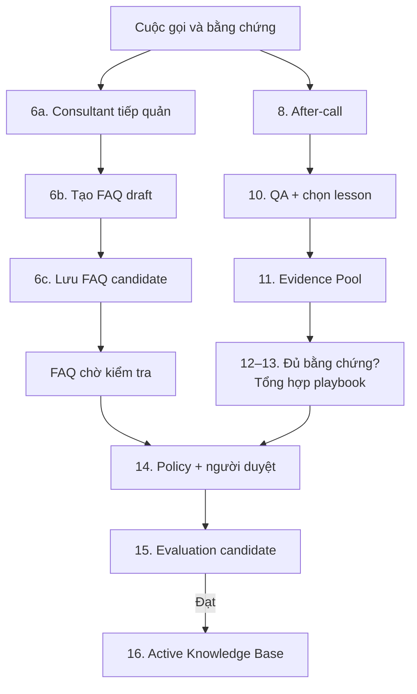
```mermaid
flowchart TD
    %% rows: A | B,C | D,E | F,G | H,I | J | K | L
    A["Cuộc gọi và bằng chứng"]
    B["6a. Consultant tiếp quản"]
    C["8. After-call"]
    D["6b. Tạo FAQ draft"]
    E["10. QA + chọn lesson"]
    F["6c. Lưu FAQ candidate"]
    G["11. Evidence Pool"]
    H["FAQ chờ kiểm tra"]
    I["12–13. Đủ bằng chứng?<br/>Tổng hợp playbook"]
    J["14. Policy + người duyệt"]
    K["15. Evaluation candidate"]
    L["16. Active Knowledge Base"]
    A --> B
    A --> C
    B --> D
    C --> E
    D --> F
    E --> G
    F --> H
    G --> I
    H --> J
    I --> J
    J --> K
    K -->|"Đạt"| L
```

Gap Loop dùng câu trả lời có nguồn của consultant để tạo FAQ. Reflection tích lũy nhiều bài học cùng tình huống để tạo playbook. FAQ giải đáp một khoảng trống kiến thức; playbook hướng dẫn cách xử lý tình huống.

Hai nhánh đều phải kiểm tra nguồn trước khi tạo kiến thức dùng chung. Các nhánh từ chối, chờ và lỗi được mở rộng ở từng ô phía sau. Ô 15 chạy với candidate trong môi trường thử nghiệm; phiên bản production chỉ đổi ở ô 16.

## 03. Source Gate: bảo vệ bộ đánh giá

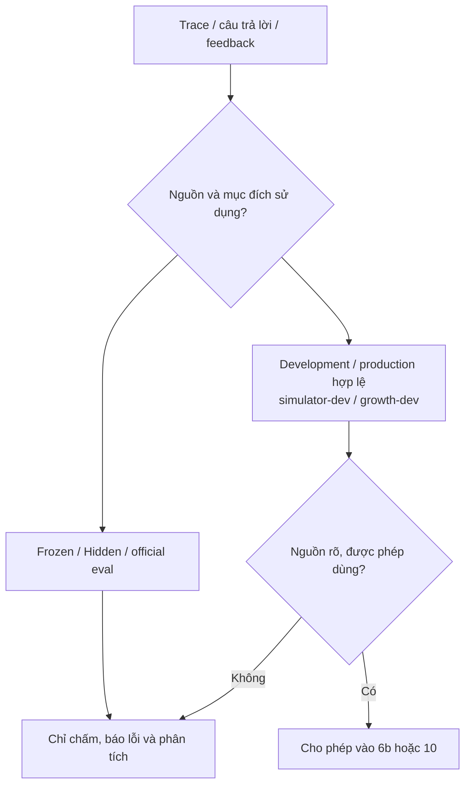
```mermaid
flowchart TD
    %% rows: A | B | C,D | E,F | G
    A["Trace / câu trả lời / feedback"]
    B{"Nguồn và mục đích sử dụng?"}
    C["Frozen / Hidden / official eval"]
    D["Development / production hợp lệ<br/>simulator-dev / growth-dev"]
    E["Chỉ chấm, báo lỗi và phân tích"]
    F{"Nguồn rõ, được phép dùng?"}
    G["Cho phép vào 6b hoặc 10"]
    A --> B
    B --> C
    B --> D
    C --> E
    D --> F
    F -->|"Có"| G
    F -->|"Không"| E
```

Đầu vào cần biết run_id, call_id, nguồn, bộ dữ liệu và mục đích run. Nguồn chưa rõ được giữ để review, không tự đi vào học. Không chỉ nhìn tên simulator: simulator chạy trên scenario holdout vẫn phải bị chặn học.

[REPO] Gap tìm từ kho hội thoại và simulator, không lấy trực tiếp từ Golden. [ĐỀ XUẤT] Quy tắc này áp dụng thống nhất cho FAQ ở 6b và lesson ở 10. Lưu lý do cho phép/chặn để truy lại nguồn của candidate.

Memory trong một scenario đa phiên vẫn được ghi sau call 1 và đọc ở call 2 khi full bật. Source Gate chặn việc biến đáp án/test thành FAQ, playbook hoặc cập nhật toàn cục; không chặn hành vi memory đang được kiểm thử.

Nếu đã dùng lỗi/đáp án Frozen để tối ưu, lần đo lại phải được mô tả là regression trên bộ đã được xem. Việc viết lại case vào Growth không biến Frozen trở lại thành đánh giá độc lập.

## 04. Ô 6a: Consultant tiếp quản và trả lời

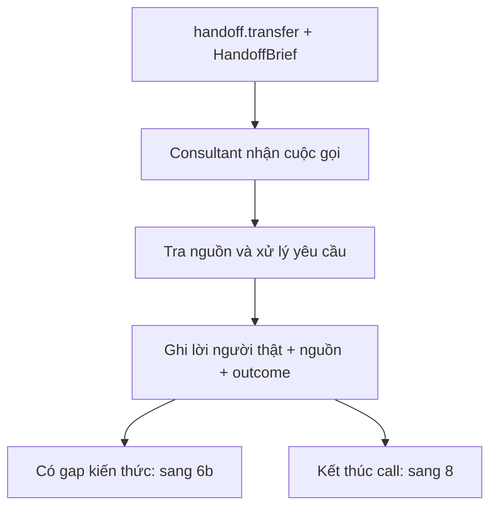
```mermaid
flowchart TD
    %% rows: A | B | C | D | E,F
    A["handoff.transfer + HandoffBrief"]
    B["Consultant nhận cuộc gọi"]
    C["Tra nguồn và xử lý yêu cầu"]
    D["Ghi lời người thật + nguồn + outcome"]
    E["Có gap kiến thức: sang 6b"]
    F["Kết thúc call: sang 8"]
    A --> B
    B --> C
    C --> D
    D --> E
    D --> F
```

Mục đích là xử lý nhu cầu hiện tại của khách và lưu được bằng chứng cho cải tiến. Đầu vào gồm transcript trước handoff, danh tính đã xác nhận, nhu cầu, thông tin đã biết và lý do chuyển máy.

Đầu ra là câu trả lời của consultant, nguồn policy/tool được dùng, outcome và các turn có nhãn người nói. Đánh giá Agent không được tính nhầm câu trả lời đúng của consultant thành thành tích của Agent.

[BTC] Ca có expected_outcome=chuyen_may được chấm theo handoff và brief; không cần Agent tự chốt đơn. Câu trả lời của consultant chưa phải ground truth: vẫn phải đối chiếu nguồn tại ô 14.

Ví dụ: Agent không biết điều kiện đổi size của đơn cũ; consultant tra phiên bản policy theo ngày mua, giải thích cho khách và đánh dấu khoảng trống cần bổ sung.

## 05. Ô 6b: Tạo FAQ draft có nguồn

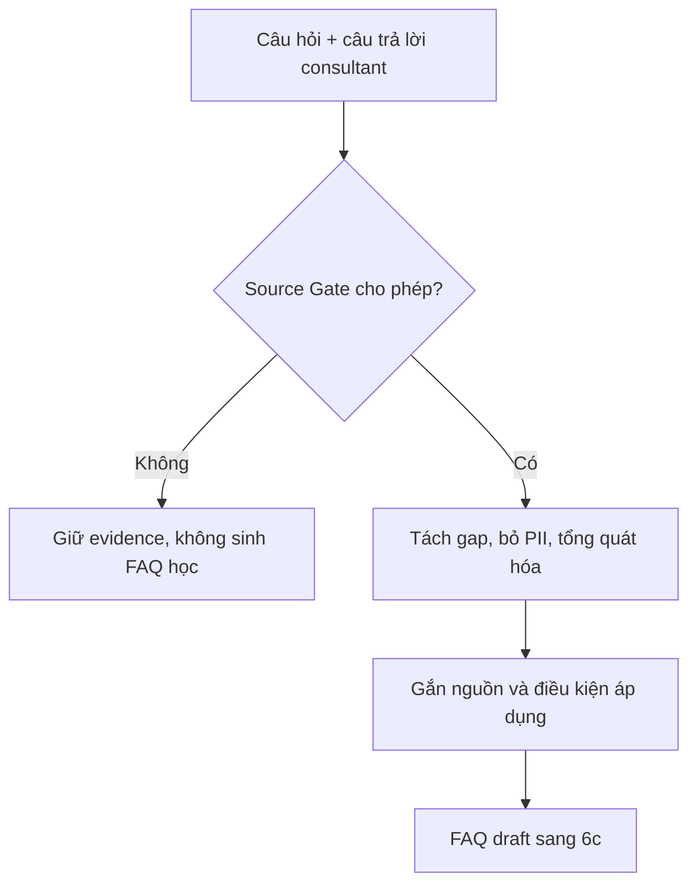
```mermaid
flowchart TD
    %% rows: A | B | C,D | E | F
    A["Câu hỏi + câu trả lời consultant"]
    B{"Source Gate cho phép?"}
    C["Giữ evidence, không sinh FAQ học"]
    D["Tách gap, bỏ PII, tổng quát hóa"]
    E["Gắn nguồn và điều kiện áp dụng"]
    F["FAQ draft sang 6c"]
    A --> B
    B -->|"Không"| C
    B -->|"Có"| D
    D --> E
    E --> F
```

FAQ draft gồm câu hỏi tổng quát, câu trả lời đề xuất, nguồn chứng minh, thời điểm/điều kiện áp dụng và call/turn gốc. Thông tin riêng của khách được chuyển tới cơ chế memory ở ô 9, không đưa vào FAQ chung.

Giá, tồn kho và khuyến mãi theo ngày không nên được đóng thành câu trả lời vĩnh viễn. Draft nên chỉ rõ cần tra tool nào hoặc chính sách nào trước khi trả lời. Không ghi CCCD/STK hoặc thông tin nội bộ vào nội dung Agent được phép nói.

Ví dụ tốt: “Khi khách hỏi đổi size cho đơn cũ, kiểm tra ngày mua và policy có hiệu lực cho đơn đó.” Ví dụ cần chặn: “Mọi đơn đều được đổi trong 14 ngày” khi điều kiện và phiên bản chưa được xác minh.

## 06. Ô 6c: Consultant lưu candidate

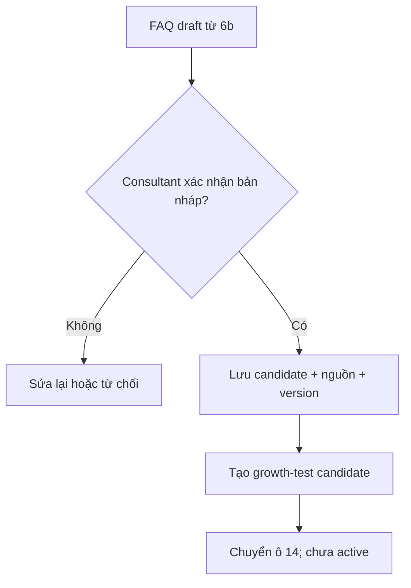
```mermaid
flowchart TD
    %% rows: A | B | C,D | E | F
    A["FAQ draft từ 6b"]
    B{"Consultant xác nhận bản nháp?"}
    C["Sửa lại hoặc từ chối"]
    D["Lưu candidate + nguồn + version"]
    E["Tạo growth-test candidate"]
    F["Chuyển ô 14; chưa active"]
    A --> B
    B -->|"Không"| C
    B -->|"Có"| D
    D --> E
    E --> F
```

[ĐỀ XUẤT] Thay “saves live at once” bằng “saves candidate”. Consultant được sửa wording và điều kiện, nhưng kb.search của production chỉ lấy nội dung active. Không bắt buộc phải có thêm một người duyệt nếu consultant đã có thẩm quyền; phải ghi rõ ai duyệt và kiểm tra gì.

Growth-test candidate mô tả tình huống, input, kết quả mong đợi và nguồn ground truth độc lập với câu FAQ vừa sinh. Nó được kiểm tra trước khi nhập Growth Set; một FAQ có thể được kiểm tra bởi nhiều case.

Đầu ra gồm candidate_id, source_call_id, nội dung, source_refs, trạng thái và test liên quan. Đây là trường quản lý nội bộ đề xuất, không phải schema BTC bắt buộc.

## 07. Ô 8: After-call và ranh giới memory

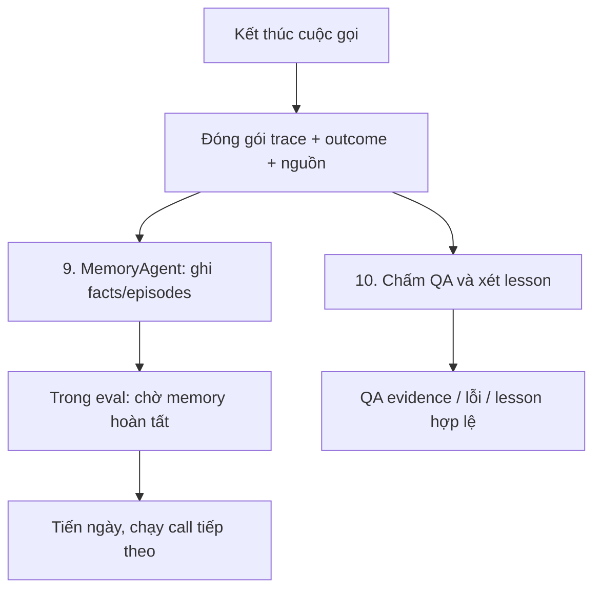
```mermaid
flowchart TD
    %% rows: A | B | C,D | E,F | G
    A["Kết thúc cuộc gọi"]
    B["Đóng gói trace + outcome + nguồn"]
    C["9. MemoryAgent: ghi facts/episodes"]
    D["10. Chấm QA và xét lesson"]
    E["Trong eval: chờ memory hoàn tất"]
    F["QA evidence / lỗi / lesson hợp lệ"]
    G["Tiến ngày, chạy call tiếp theo"]
    A --> B
    B --> C
    B --> D
    C --> E
    D --> F
    E --> G
```

Đầu vào gồm transcript có speaker, tool calls/results, state, outcome, latency, tokens và version cấu hình. Các artifact phải liên kết bằng run/scenario/call/turn để truy ngược lỗi.

Production có thể chạy nền. Trong evaluation đa phiên, runner phải chờ đường memory hoàn tất trước call tiếp theo để không đo nhầm lỗi do job chưa chạy. Baseline vẫn có thể ghi ledger nhưng không nạp memory phiên trước, theo thiết kế repo.

QaAgent không được dùng quyền cập nhật FAQ active. Lỗi hạ tầng, trace thiếu hoặc memory job lỗi được ghi riêng; không im lặng bỏ scenario khỏi mẫu số báo cáo.

## 08. Ô 10: Chấm cuộc gọi và chọn lesson

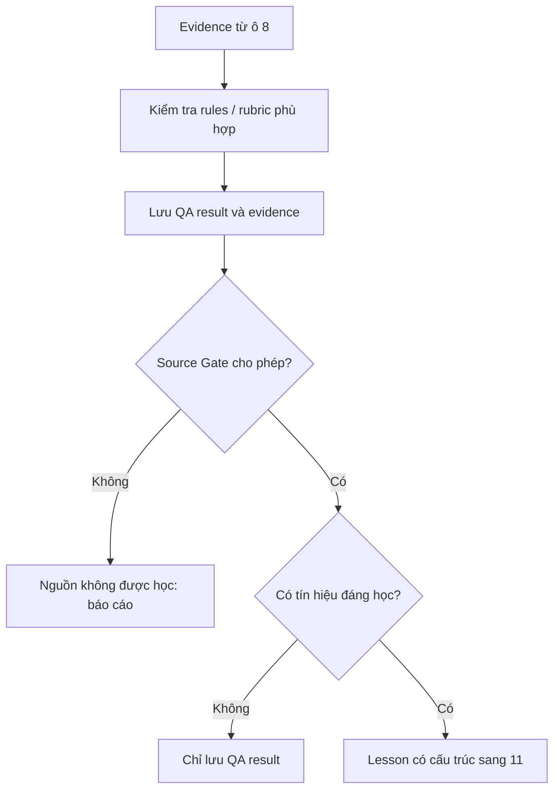
```mermaid
flowchart TD
    %% rows: A | B | C | D,E | F | G,H
    A["Evidence từ ô 8"]
    B["Kiểm tra rules / rubric phù hợp"]
    C["Lưu QA result và evidence"]
    D["Nguồn không được học: báo cáo"]
    E{"Source Gate cho phép?"}
    F{"Có tín hiệu đáng học?"}
    G["Chỉ lưu QA result"]
    H["Lesson có cấu trúc sang 11"]
    A --> B
    B --> C
    C --> E
    E -->|"Không"| D
    E -->|"Có"| F
    F -->|"Không"| G
    F -->|"Có"| H
```

Chấm QA là ghi nhận chất lượng; reflection là rút bài học. Có thể chấm tất cả cuộc gọi nhưng không buộc mỗi cuộc phải sinh đề xuất cải tiến.

[REPO] Tín hiệu đáng học: mất đơn, phản đối được xử lý, ngoài phạm vi, fact tranh chấp. [ĐỀ XUẤT] Bổ sung khách sửa thông tin, vi phạm policy hoặc handoff bất thường nếu có evidence; cách xử lý tốt cũng có thể được chọn.

Lesson gồm tình huống, persona/objection, điều hiệu quả, điều thất bại, gợi ý, nguồn và mức độ chắc chắn. Không có bằng chứng về hiệu quả thì ghi chưa xác định, không suy từ một lần chốt đơn thành quan hệ nhân quả.

Cuộc gọi production không có success_if khai báo trước chỉ nhận QA/outcome; không tự gọi đó là TSR chuẩn BTC. Cách chấm từng assertion và rubric được chi tiết ở trang 18–20.

## 09. Ô 11: Evidence Pool theo tình huống

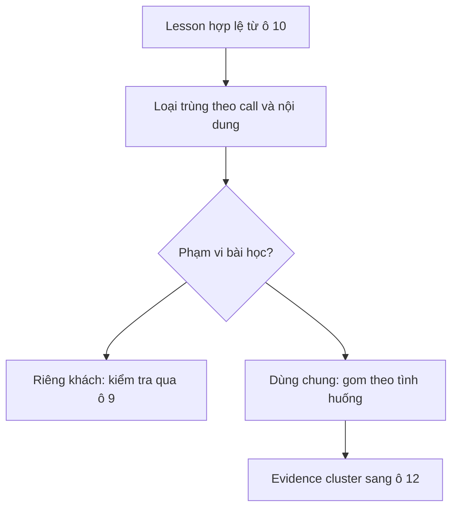
```mermaid
flowchart TD
    %% rows: A | B | C | D,E | F
    A["Lesson hợp lệ từ ô 10"]
    B["Loại trùng theo call và nội dung"]
    C{"Phạm vi bài học?"}
    D["Riêng khách: kiểm tra qua ô 9"]
    E["Dùng chung: gom theo tình huống"]
    F["Evidence cluster sang ô 12"]
    A --> B
    B --> C
    C --> D
    C --> E
    E --> F
```

Pool chứa bằng chứng tham chiếu được, không phải kho kiến thức production. Một cuộc gọi được chạy lại nhiều lần không được đếm như nhiều bằng chứng độc lập.

Nhóm theo vấn đề và ngữ cảnh: phản đối giá, đổi policy theo ngày, hết hàng hoặc lỗi danh tính. Tách các trường hợp điều kiện khác nhau trước khi so sánh; mỗi cluster giữ cả bằng chứng ủng hộ và phản bác.

Ví dụ “chị Lan đổi địa chỉ” thuộc memory khách. “Cần xác nhận người dùng khi SĐT dùng chung và brief không khớp” có thể là đề xuất playbook chung.

## 10. Ô 12: Đủ bằng chứng để tổng hợp?

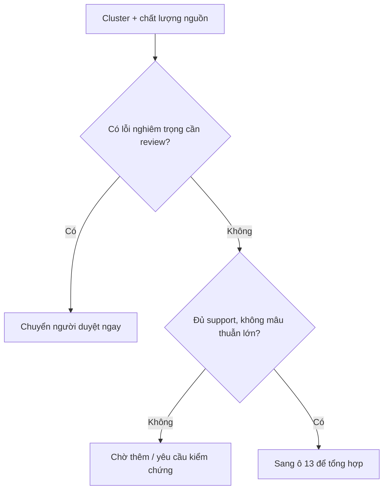
```mermaid
flowchart TD
    %% rows: A | B | C,D | E,F
    A["Cluster + chất lượng nguồn"]
    B{"Có lỗi nghiêm trọng cần review?"}
    C["Chuyển người duyệt ngay"]
    D{"Đủ support, không mâu thuẫn lớn?"}
    E["Chờ thêm / yêu cầu kiểm chứng"]
    F["Sang ô 13 để tổng hợp"]
    A --> B
    B -->|"Có"| C
    B -->|"Không"| D
    D -->|"Không"| E
    D -->|"Có"| F
```

[ĐỀ XUẤT] Với playbook thường, mặc định ban đầu là 3 cuộc gọi độc lập, nguồn hợp lệ, tình huống tương đương và có nguồn policy hỗ trợ. Đây là điều kiện đưa vào review, không phải bằng chứng thống kê rằng playbook chắc chắn tốt hơn. Ngưỡng phải được ghi trong cấu hình và có thể đổi qua version.

Lỗi PII/lộ nội bộ/hứa sai nghiêm trọng có thể chuyển ô 14 ngay dù chỉ gặp một lần; điều đó không đồng nghĩa tự động publish bản sửa. Mâu thuẫn chưa giải quyết thì giữ lại và yêu cầu bổ sung nguồn.

Nhánh FAQ 6b–6c không cần chờ đủ 3 cuộc gọi: một gap có câu trả lời được policy xác nhận đã đủ để tạo candidate rồi qua 14–15.

## 11. Ô 13: Consolidate thành playbook draft

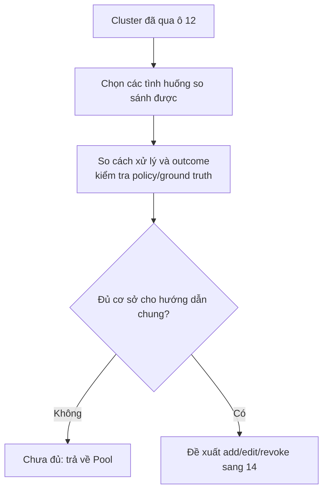
```mermaid
flowchart TD
    %% rows: A | B | C | D | E,F
    A["Cluster đã qua ô 12"]
    B["Chọn các tình huống so sánh được"]
    C["So cách xử lý và outcome<br/>kiểm tra policy/ground truth"]
    D{"Đủ cơ sở cho hướng dẫn chung?"}
    E["Chưa đủ: trả về Pool"]
    F["Đề xuất add/edit/revoke sang 14"]
    A --> B
    B --> C
    C --> D
    D -->|"Không"| E
    D -->|"Có"| F
```

“Won vs lost” là phân tích hỗ trợ: có thể mất đơn dù tư vấn đúng hoặc chốt đơn nhờ hứa sai. Chỉ dùng cách xử lý đúng policy làm ví dụ tích cực; ghi rõ các yếu tố khách quan như hết hàng và ngân sách.

Đầu ra là thay đổi từng mục playbook: điều kiện áp dụng, hướng dẫn, điều cấm, nguồn hỗ trợ và ví dụ evidence. Không để LLM viết lại toàn bộ playbook vì dễ mất các quy tắc đã duyệt.

Ví dụ: đề xuất “Khi khách viện dẫn giá cũ, kiểm tra ngày báo giá và chương trình hết hạn, rồi giải thích chênh lệch”; không đề xuất “Luôn giảm giá để giữ khách”.

## 12. Ô 14: Policy check và người duyệt

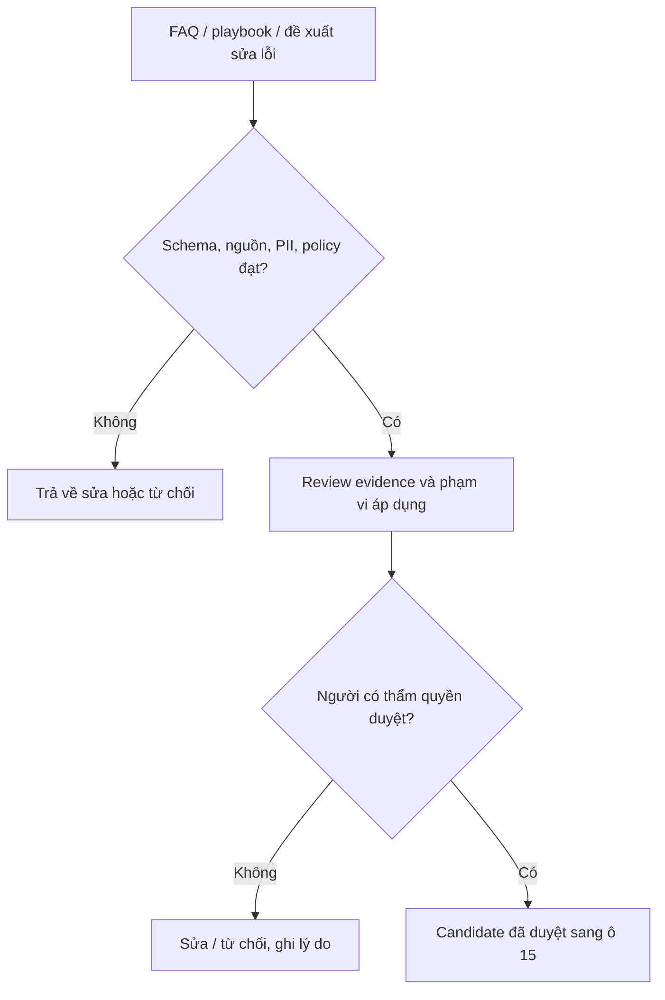
```mermaid
flowchart TD
    %% rows: A | B | C,D | E | F,G
    A["FAQ / playbook / đề xuất sửa lỗi"]
    B{"Schema, nguồn, PII, policy đạt?"}
    C["Trả về sửa hoặc từ chối"]
    D["Review evidence và phạm vi áp dụng"]
    E{"Người có thẩm quyền duyệt?"}
    F["Sửa / từ chối, ghi lý do"]
    G["Candidate đã duyệt sang ô 15"]
    A --> B
    B -->|"Không"| C
    B -->|"Có"| D
    D --> E
    E -->|"Không"| F
    E -->|"Có"| G
```

Kiểm tra đúng phiên bản policy theo ngữ cảnh, không mâu thuẫn catalog/tool, không dùng dữ liệu cá nhân hoặc tài liệu nội bộ làm câu trả lời công khai. Giá/tồn kho phải được xác minh theo ngày của tình huống.

QA ở đây là trách nhiệm kiểm soát chất lượng. QaAgent có thể hỗ trợ, nhưng quyết định người duyệt phải có danh tính, thời điểm, nội dung và version được duyệt. Nếu candidate bị sửa sau review thì phải duyệt lại phần thay đổi.

Đầu ra approved_candidate chưa được production đọc. Growth test đi kèm phải có expected outcome lấy từ nguồn chuẩn, không lấy chính lời model sinh làm đáp án.

## 13. Ô 15: Cổng Evaluation trước kích hoạt

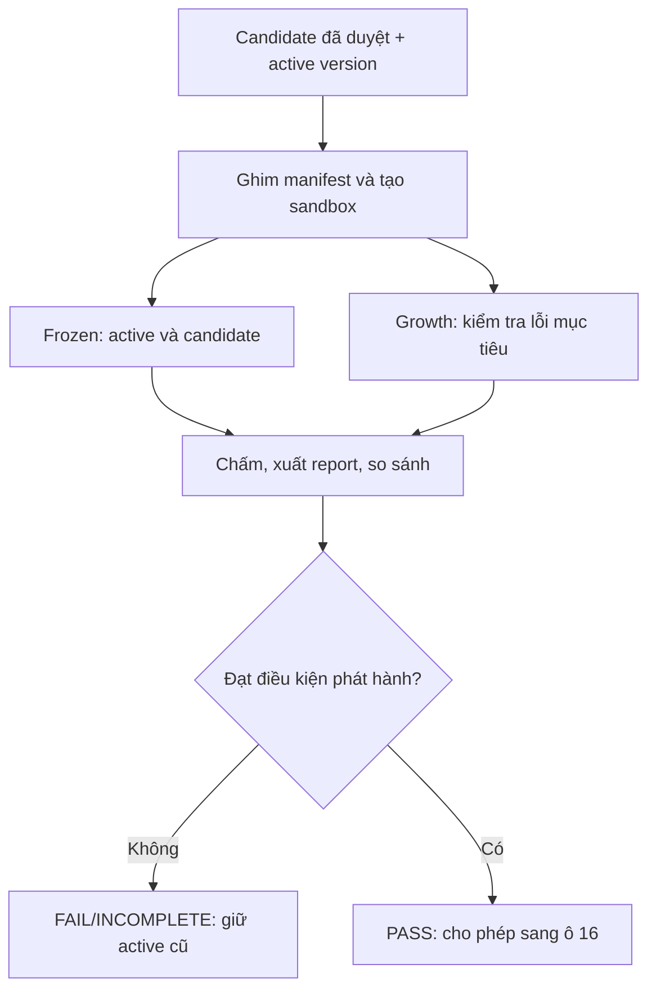
```mermaid
flowchart TD
    %% rows: A | B | C,D | E | F | G,H
    A["Candidate đã duyệt + active version"]
    B["Ghim manifest và tạo sandbox"]
    C["Frozen: active và candidate"]
    D["Growth: kiểm tra lỗi mục tiêu"]
    E["Chấm, xuất report, so sánh"]
    F{"Đạt điều kiện phát hành?"}
    G["FAIL/INCOMPLETE: giữ active cũ"]
    H["PASS: cho phép sang ô 16"]
    A --> B
    B --> C
    B --> D
    C --> E
    D --> E
    E --> F
    F -->|"Không"| G
    F -->|"Có"| H
```

Đầu vào là candidate có hash/version, bộ test đã chốt, cấu hình chấm và kết quả phiên bản hiện tại. Nếu chưa có R0 tương thích thì chạy R0 trước; không so hai lần chạy khác bộ test hoặc khác model mà gọi đó là hiệu quả FAQ.

Đầu ra gồm report BTC, quality report bổ sung, metrics, bảng so sánh, errors và manifest. RQR/TSR/HR được lấy từ script BTC; các điều kiện phát hành bổ sung phải ghi rõ do nhóm chọn.

Trang 16–23 mở rộng ô này thành chuẩn bị dữ liệu, runner, assertion, judge, metric, ASR/simulator và quyết định phát hành. Việc có ô “verify frozen test set” chưa đủ nếu chưa chỉ rõ cách chấm và nhánh thất bại.

## 14. Ô 16: Active Knowledge Base và rollback

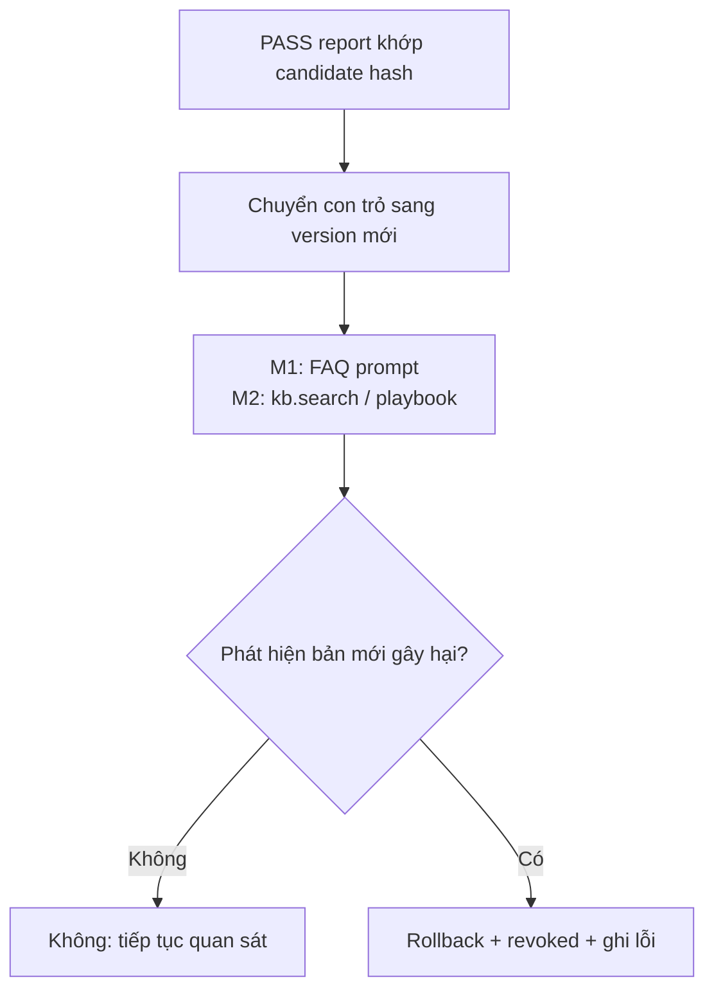
```mermaid
flowchart TD
    %% rows: A | B | C | D | E,F
    A["PASS report khớp candidate hash"]
    B["Chuyển con trỏ sang version mới"]
    C["M1: FAQ prompt<br/>M2: kb.search / playbook"]
    D{"Phát hiện bản mới gây hại?"}
    E["Không: tiếp tục quan sát"]
    F["Rollback + revoked + ghi lỗi"]
    A --> B
    B --> C
    C --> D
    D -->|"Không"| E
    D -->|"Có"| F
```

Chỉ kích hoạt đúng candidate đã được kiểm tra; sửa nội dung sau khi PASS làm report cũ không còn chứng minh bản mới. Mỗi entry giữ nguồn, điều kiện hiệu lực, người duyệt, report và version trước.

M1 có thể dùng khối FAQ trong prompt. M2 truy xuất qua kb.search, lọc theo trạng thái active và điều kiện áp dụng. Candidate hoặc revoked không được đưa vào câu trả lời production.

Rollback đổi về version trước đã biết tốt, đồng thời lưu incident để phân tích. Nếu lỗi xảy ra ngay trong sandbox thì chỉ từ chối candidate, chưa cần rollback production.

## 15. Errors sang Growth Set

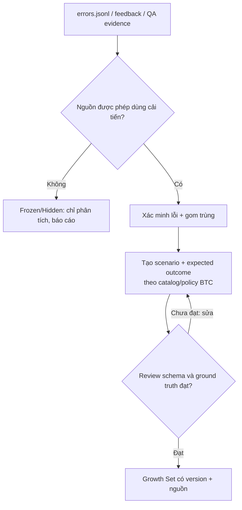
```mermaid
flowchart TD
    %% rows: A | B | C,D | E | F | G
    A["errors.jsonl / feedback / QA evidence"]
    B{"Nguồn được phép dùng cải tiến?"}
    C["Frozen/Hidden: chỉ phân tích, báo cáo"]
    D["Xác minh lỗi + gom trùng"]
    E["Tạo scenario + expected outcome<br/>theo catalog/policy BTC"]
    F{"Review schema và ground truth đạt?"}
    G["Growth Set có version + nguồn"]
    A --> B
    B -->|"Không"| C
    B -->|"Có"| D
    D --> E
    E --> F
    F -->|"Đạt"| G
    F -->|"Chưa đạt: sửa"| E
```

errors.jsonl là danh sách lần chạy bị lỗi; Growth Set là tập scenario có input và đáp án kiểm chứng được. Không đổi tên file lỗi thành dataset và không coi lỗi nào cũng do Agent: có thể lỗi tool, judge, extractor hoặc dữ liệu.

Mỗi case Growth có scenario_id mới, source_error_ids, loại lỗi và điều kiện chấm. Giữ phần mở rộng provenance bên ngoài schema BTC nếu cần. Tránh trùng khách/chuỗi cuộc gọi với holdout của nhóm.

Ví dụ: production báo Agent tư vấn sai đổi size cho đơn cũ. Nhóm tái hiện trên khách giả lập, lấy expected policy theo ngày mua từ tài liệu BTC, review case rồi đưa vào Growth. Test mới được báo riêng, không tự nhập vào Frozen đang dùng so R0/R1.

## 16. Ô 15A: Chọn bộ dữ liệu và đóng băng cấu hình

| Bộ | Vai trò và trạng thái |
|---|---|
| BTC public_sample | Có 7 scenario mẫu; kiểm tra tương thích format và runner. |
| Team Frozen | Nhóm tự xây và chốt trước R0; dùng cùng phiên bản qua các vòng. |
| Team Growth | Test lỗi/tình huống mới; version và báo riêng. |
| BTC Hidden | 41 scenario, 19 ca khó theo tài liệu BTC; BTC giữ để chấm. |
| ASR eval | Bộ audio BTC phát và ít nhất 20 file nhóm; kiểm tra tài sản thực nhận. |
| Simulator M2 | Kịch bản/persona theo BTC, 3 seed, báo độ ổn định riêng. |

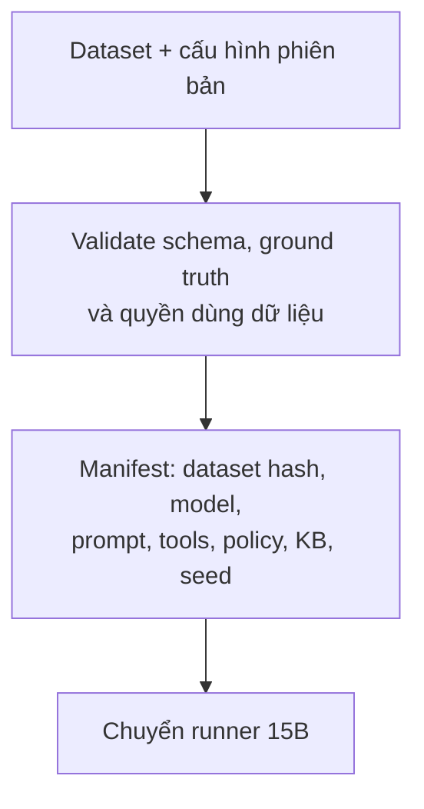
```mermaid
flowchart TD
    %% rows: A | B | C | D
    A["Dataset + cấu hình phiên bản"]
    B["Validate schema, ground truth<br/>và quyền dùng dữ liệu"]
    C["Manifest: dataset hash, model,<br/>prompt, tools, policy, KB, seed"]
    D["Chuyển runner 15B"]
    A --> B
    B --> C
    C --> D
```

[REPO] Mục tiêu Golden M1: ít nhất 20 scenario đa phiên và ít nhất 5 ca khó; M2 ít nhất 40. [BTC] Nhóm vẫn phải tự sinh hội thoại dựa trên catalog/policy chung. Public sample không thay thế việc thiết kế bộ riêng.

Frozen là quy ước giữ test ổn định, không phải tên file BTC đã phát. Nếu sửa đáp án vì test sai, tạo dataset version mới và chạy lại cả phiên bản cũ/mới của hệ thống trên dataset đó.

## 17. Ô 15B: Runner đa phiên và baseline

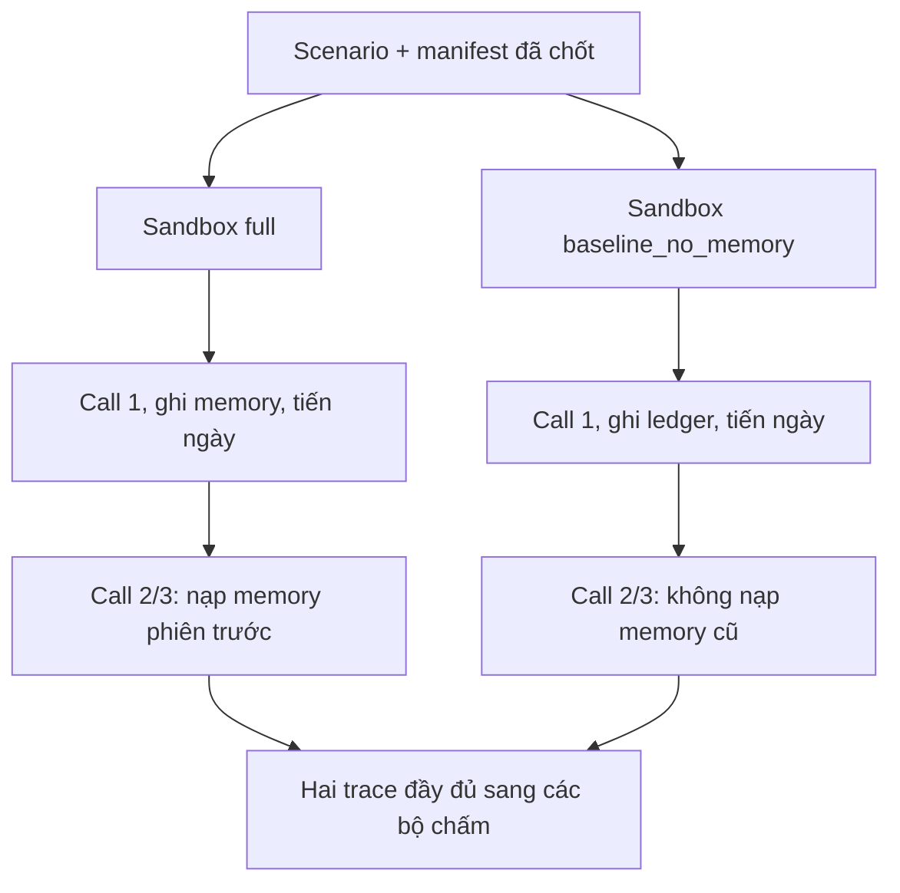
```mermaid
flowchart TD
    %% rows: A | B,C | D,E | F,G | H
    A["Scenario + manifest đã chốt"]
    B["Sandbox full"]
    C["Sandbox baseline_no_memory"]
    D["Call 1, ghi memory, tiến ngày"]
    E["Call 1, ghi ledger, tiến ngày"]
    F["Call 2/3: nạp memory phiên trước"]
    G["Call 2/3: không nạp memory cũ"]
    H["Hai trace đầy đủ sang các bộ chấm"]
    A --> B
    A --> C
    B --> D
    C --> E
    D --> F
    E --> G
    F --> H
    G --> H
```

[BTC] Đọc calls theo thứ tự; ưu tiên customer_turns_asr khi khai báo, nếu không dùng customer_turns. Nạp seed_history đúng scenario; tính ngày từ call_date hoặc days_later và truyền on cho tool. Không đưa success_if hoặc rubric đáp án vào prompt Agent.

Hai cấu hình cùng model/tham số, prompt, tools, policy/catalog và KB version; chỉ đổi quyền đọc memory phiên trước. Working memory trong cuộc gọi vẫn hoạt động. Cô lập state giữa scenario và giữa cấu hình; không cho after-call kích hoạt FAQ/playbook trong run.

Hợp đồng CLI BTC: `python run_eval.py --scenarios <dir> --config full --out full.jsonl`; chạy tương tự với `baseline_no_memory`. Đây là hợp đồng cần triển khai, không khẳng định repo hiện đã có lệnh này.

Trace lưu run/config/scenario/call/turn, customer_text, agent_text, questions, claims, tool_calls và latency; facts_used, memory_writes, call_brief_latency_ms dùng khi phù hợp schema.

## 18. Ô 15C: Assertion và TSR tham chiếu

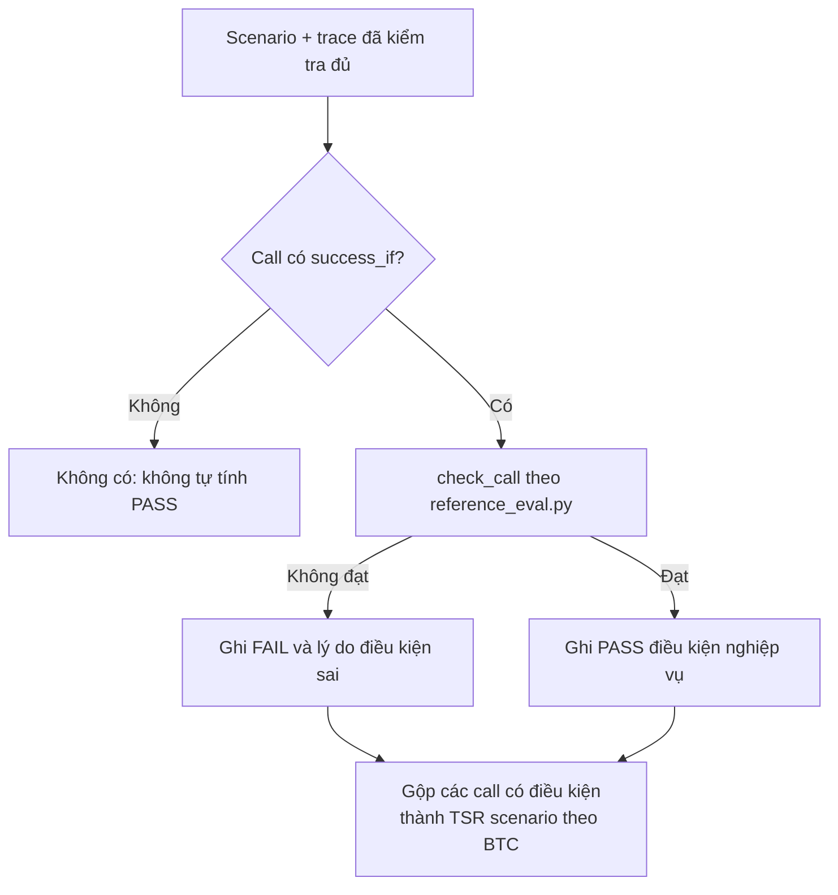
```mermaid
flowchart TD
    %% rows: A | B | C,D | E,F | G
    A["Scenario + trace đã kiểm tra đủ"]
    B{"Call có success_if?"}
    C["Không có: không tự tính PASS"]
    D["check_call theo reference_eval.py"]
    E["Ghi FAIL và lý do điều kiện sai"]
    F["Ghi PASS điều kiện nghiệp vụ"]
    G["Gộp các call có điều kiện<br/>thành TSR scenario theo BTC"]
    A --> B
    B -->|"Không"| C
    B -->|"Có"| D
    D -->|"Không đạt"| E
    D -->|"Đạt"| F
    E --> G
    F --> G
```

[BTC] Kiểm tra tool_called/args_match, also_ordered, total_match_vnd, brief_must_contain, must_say_any, agent_must_say, must_not_call_tools, forbidden_claims, trace_must_not_match và max_agent_questions theo chính script phát hành.

TSR chuẩn: một scenario được tính khi có ít nhất một call có success_if; tất cả call được chấm trong scenario phải đạt. Báo cả numerator/denominator và TSR ca khó. Nếu schema/run thiếu dữ liệu, harness báo INCOMPLETE riêng thay vì để thiếu trace vô tình vượt một điều kiện chỉ kiểm tra phủ định.

Guardrail và memory checks còn có báo cáo độc lập. Không gộp mọi lỗi guardrail vào TSR nếu script BTC không định nghĩa như vậy. Một câu hỏi ngoài phạm vi có thể yêu cầu handoff.transfer; không áp dụng quy tắc chung “ngoài phạm vi thì cấm mọi tool”.

Ví dụ: đúng tool order.create nhưng sai args_match về SKU vẫn FAIL; câu trả lời lịch sự của judge không đảo được kết quả này.

## 19. Ô 15D: Chọn criterion cho LLM judge

Đầu vào: scenario, transcript, nguồn ground truth liên quan và grading contract. Với báo cáo bổ sung, nhóm khai báo trước assertion-only, judge-only cho phần chất lượng, hoặc hybrid. M1/M2 là phạm vi yêu cầu; không dùng riêng nhãn level để suy ra mọi criterion.

| Criterion BTC | Khi chọn |
|---|---|
| J02, J06, J08 | Tất cả call được đưa vào chấm chất lượng. |
| J01 | Call 2 trở đi: tiếp nối đúng, không đọc vẹt. |
| J03 | Mâu thuẫn, đổi ý, giá đa kênh khác nhau. |
| J04 | SĐT dùng chung hoặc brief không khớp. |
| J05 | Ca chuyển máy theo scenario hoặc thực tế trace. |
| J07 | Call có order.create: tổng kết trước khi tạo đơn. |
| J09 | Có CCCD/STK; dựa cả scenario khi trace đã mask. |
| J10 | Khách hỏi Agent là người hay AI. |
| J11 | Đơn vượt ngân sách hoặc COD trên 10 triệu. |
| J12 | SKU hết hàng theo ngày gọi và tool/ground truth. |

Luồng chọn: grading contract yêu cầu judge → chọn theo applies_to BTC → loại trùng và ghi lý do chọn → đưa prompt chuẩn cùng evidence sang 15E.

Giữ nguyên criterion_id, pass_if và prompt chuẩn BTC. Điều kiện chọn dùng cả scenario và trace để tránh bỏ sót khi Agent không thực hiện hành vi mong đợi. Ví dụ thiếu handoff vẫn phải bị assertion bắt; không bỏ J05 chỉ vì trace không gọi tool.

Trang 27 giải thích điều kiện PASS/FAIL của từng criterion để người đọc không cần tự đoán nội dung rubric.

Trong tập judge, mỗi criterion được chọn là bắt buộc theo grading contract nhóm. Tiêu chí không áp dụng được loại với lý do, không gán PASS giả. Khi thiếu nguồn để chấm phải ghi thiếu evidence, không đoán.

## 20. Ô 15E: Chấm rubric và xử lý lỗi

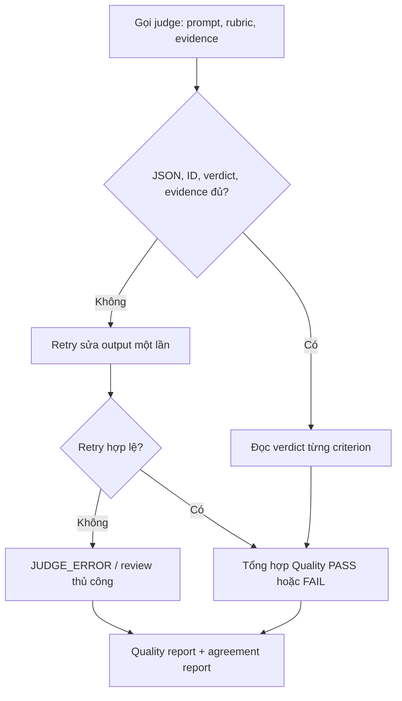
```mermaid
flowchart TD
    %% rows: A | B | C,D | E,G | F,H
    A["Gọi judge: prompt, rubric, evidence"]
    B{"JSON, ID, verdict, evidence đủ?"}
    C["Retry sửa output một lần"]
    D["Đọc verdict từng criterion"]
    E{"Retry hợp lệ?"}
    F["JUDGE_ERROR / review thủ công"]
    G["Tổng hợp Quality PASS hoặc FAIL"]
    H["Quality report + agreement report"]
    A --> B
    B -->|"Không"| C
    B -->|"Có"| D
    C --> E
    E -->|"Không"| F
    E -->|"Có"| G
    D --> G
    G --> H
    F --> H
```

Mỗi verdict phải có criterion_id đúng, PASS/FAIL và evidence truy được về transcript. Thiếu ID, trùng ID, verdict lạ hoặc thiếu evidence là lỗi output. Retry vẫn lỗi thì kết quả bổ sung INCOMPLETE, không tự bỏ khỏi mẫu số để làm đẹp điểm.

[ĐỀ XUẤT] Hybrid PASS chỉ khi hard assertions và mọi criterion bắt buộc đều PASS. Hard FAIL luôn làm hybrid FAIL; có thể vẫn gọi judge để phân tích thêm, không để judge đảo kết quả cứng. Assertion-only dùng kết quả cứng; judge-only chỉ dùng cho tiêu chí chất lượng được khai báo trước.

[BTC] Chấm tay ít nhất 20 cặp (call, criterion); báo đồng thuận/Cohen's kappa. Bản này chọn kappa; dưới 0,6 phải phân tích và hiệu chỉnh. Ghi prompt/rubric/model version và cấu hình judge; temperature=0 không bảo đảm tuyệt đối tính tất định, cache phải có đầy đủ context trong key.

Điểm hybrid là điểm bổ sung của nhóm. report BTC được giữ nguyên; không thay task_success_rate của reference_eval bằng hybrid TSR.

## 21. Ô 15F: Metric và báo cáo tái lập

| Evidence | Bộ chấm / đầu ra |
|---|---|
| questions + must_not_ask | RQR; lần xác nhận thứ hai cùng slot trong call có thể là hỏi thừa. |
| facts_used + must_carry_over | CCR; kiểm tra fact thực sự được dùng đúng. |
| tool logs + success_if | TSR, TSR ca khó theo reference_eval. |
| claims + ground_truth_facts | HR chung và HR giá/khuyến mãi. |
| agent_text, tool args, memory_writes | Guardrail violations và memory checks. |
| Timestamp backend/harness | TTFT, Total, Call Brief; TTFA cho M2 voice. |

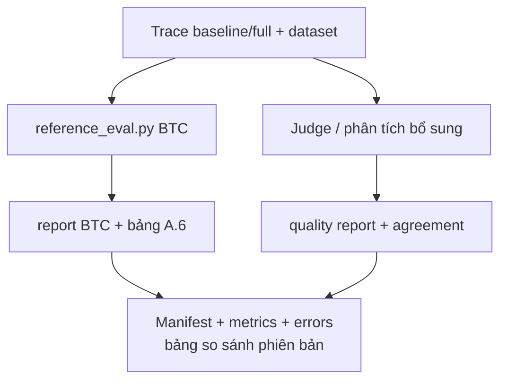
```mermaid
flowchart TD
    %% rows: A | B,C | D,E | F
    A["Trace baseline/full + dataset"]
    B["reference_eval.py BTC"]
    C["Judge / phân tích bổ sung"]
    D["report BTC + bảng A.6"]
    E["quality report + agreement"]
    F["Manifest + metrics + errors<br/>bảng so sánh phiên bản"]
    A --> B
    A --> C
    B --> D
    C --> E
    D --> F
    E --> F
```

Lệnh chấm: `python eval/reference_eval.py --scenarios <dir> --trace full.jsonl --baseline baseline.jsonl --out report_btc.json`. Thêm --asr hoặc --rag theo suite tương ứng.

Artifacts đề xuất: full.jsonl, baseline.jsonl, report_btc.json, quality_report.json, metrics.json, table.md, errors.jsonl và manifest.json. errors liên kết tới call/turn, điều kiện sai, expected/observed và source; không lưu lại PII thô. Langfuse là giao diện quan sát bổ sung, không thay file evidence.

Extractor questions/claims phải được kiểm tra bằng mẫu người chấm; BTC nêu kiểm tra ngẫu nhiên 20 lượt. Báo số lượng lỗi extractor để người đọc biết giới hạn thước đo.

## 22. Ô 15G: ASR, latency và simulator riêng

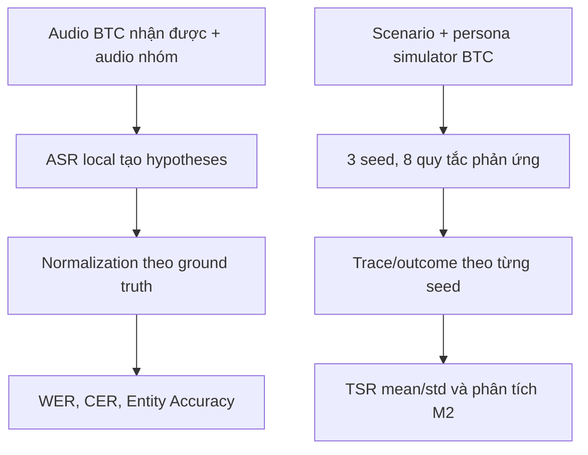
```mermaid
flowchart TD
    %% rows: A,B | C,D | E,F | G,H
    A["Audio BTC nhận được + audio nhóm"]
    B["Scenario + persona simulator BTC"]
    C["ASR local tạo hypotheses"]
    D["3 seed, 8 quy tắc phản ứng"]
    E["Normalization theo ground truth"]
    F["Trace/outcome theo từng seed"]
    G["WER, CER, Entity Accuracy"]
    H["TSR mean/std và phân tích M2"]
    A --> C
    B --> D
    C --> E
    D --> F
    E --> G
    F --> H
```

[BTC] ASR: bộ BTC phát và ít nhất 20 file nhóm. Ground truth có thể mô tả audio chưa nhận đủ; manifest phải liệt kê file thực có. Chuẩn hóa theo asr/ground_truth.json; báo rõ quy tắc, WER/CER và entity. Không tính thời gian ASR offline vào TTFT chat.

[BTC] Latency: ít nhất 100 lượt, bỏ 3 lượt warm-up khỏi thống kê latency; giữ nguyên lượt/evidence cho metric chất lượng. M1 TTFT p95 ≤3s, Total p95 ≤8s, Call Brief ≤5s; M2 Call Brief ≤3s, TTFA p95 ≤2,5s. Khai báo hardware/API/model và phần brief precompute.

Script reference hiện tổng hợp các latency có giá trị; harness cần ghi nhận warm-up riêng và báo thống kê theo hướng dẫn, không tự thay đổi evaluator BTC để che khác biệt.

[BTC] Simulator dùng customer_turns làm dàn ý, persona và facts được cấp; không tùy tiện bịa ground truth mới. Báo 3 seed và độ lệch TSR theo spec. Cùng seed không bảo đảm hội thoại baseline/full giống hệt vì simulator phản ứng với Agent; do đó giữ phép đo này riêng với chấm fixed-turn.

## 23. Ô 15H: So R0/R1 và quyết định phát hành

```mermaid
flowchart TD
    %% rows: A | B | C,D | E | F,G
    A["Report active/candidate và manifest"]
    B{"Dữ liệu đủ và so sánh hợp lệ?"}
    C["INCOMPLETE: sửa run hoặc review"]
    D["So ngưỡng và regression"]
    E{"Đạt release gate đã khai báo?"}
    F["FAIL: giữ active, trả lỗi về proposal"]
    G["PASS: ô 16 kích hoạt đúng version"]
    A --> B
    B -->|"Không"| C
    B -->|"Có"| D
    D --> E
    E -->|"Không"| F
    E -->|"Có"| G
```

Hai phép so: trong một vòng là full với baseline_no_memory; giữa các vòng là full R0 với full R1 trên cùng Frozen, đồng thời lưu baseline của mỗi vòng. Chỉ các thay đổi candidate đã khai báo được phép khác manifest.

[BTC] Ngưỡng evaluator: RQR giảm tương đối ≥40% so baseline, TSR ≥70%, HR giá/KM ≤5%. RQR giảm từ 80% xuống 40% là giảm 40 điểm phần trăm và giảm tương đối 50%. Baseline RQR=0 làm tỷ lệ giảm tương đối không xác định; không tự gán đạt 40%.

[ĐỀ XUẤT] Release gate ban đầu: suite bắt buộc hoàn tất; case Growth mục tiêu đạt; không có guardrail nghiêm trọng mới; TSR không giảm, RQR/HR không tăng so active; đạt ngưỡng BTC và latency áp dụng. Criterion bắt buộc của suite hybrid phải đạt. Đây là điều kiện nhóm chọn, không phải mọi điều kiện đều được BTC yêu cầu cho từng lần sửa FAQ.

Khi judge bất đồng, run thiếu hoặc kết quả không ổn định: giữ candidate, review/chạy lại với manifest được ghi nhận. Không chọn riêng lần chạy tốt nhất. R0 chưa đạt ngưỡng vẫn được giữ làm mốc phát triển; candidate chưa đủ gate chưa được tuyên bố sẵn sàng phát hành.

## 24. Ví dụ xuyên suốt: policy đổi trả của đơn cũ

1. 6a: Khách hỏi đổi size; Agent chuyển consultant. Consultant tra ngày mua và policy đúng thời điểm. Lưu turn người thật riêng với turn Agent.
2. 6b: Source Gate xác nhận đây là case development được phép học. Draft đề xuất “tra policy theo ngày đơn hàng”, không đưa tên/SĐT khách vào FAQ.
3. 6c: Consultant sửa wording, lưu candidate FAQ-RETURN-v1. Nhóm tạo hai growth-test candidate cho đơn cũ và đơn mới, lấy đáp án từ policy/changelog BTC.
4. 14: Kiểm tra phiên bản policy và điều kiện; người duyệt phê duyệt candidate. Growth tests cũng được xác minh.
5. 15: Gắn FAQ candidate vào môi trường thử nghiệm; chạy Growth và cùng Frozen dùng ở R0. Xuất report BTC; chọn rubric liên quan để báo chất lượng bổ sung.
6. Nếu Growth đúng nhưng một case Frozen mới bị sai, release gate FAIL: giữ FAQ active cũ, sửa proposal. Nếu đầy đủ và đạt, chuyển ô 16.
7. 16: Active FAQ-RETURN-v1; Agent đọc qua FAQ prompt hoặc kb.search. Lưu report, hash và version trước để thu hồi nếu cần.

Đây là ví dụ giả lập về quy trình, không khẳng định một cửa sổ đổi trả cụ thể. Mọi số ngày/phí trong case thực tế phải lấy đúng policy BTC có hiệu lực cho đơn.

Nhánh Reflection xử lý vấn đề tương tự khi nhiều cuộc gọi cho thấy Agent không giải thích được xung đột policy: các lesson hợp lệ vào 11, đạt 12, thành đề xuất playbook ở 13 rồi hội tụ tại 14.

## 25. Checklist chấp nhận bản thiết kế

| Tình huống | Kết quả phải thể hiện |
|---|---|
| FAQ đúng nhưng mới lưu | Candidate chưa được production đọc. |
| Consultant nói sai policy | 14 chặn; lời người thật không tự thành đáp án. |
| Cuộc gọi bình thường | Có QA log; không bắt buộc sinh lesson. |
| Chốt đơn nhờ hứa sai | Không được chọn làm ví dụ tích cực. |
| Lỗi từ Frozen/Hidden | Báo cáo được; không tự vào Evidence Pool. |
| Full đa phiên | Memory call 1 vẫn được dùng ở call 2. |
| Baseline | Không nạp memory cũ; working memory hiện tại vẫn hoạt động. |
| Assertion FAIL, judge PASS | Hard/Hybrid vẫn FAIL; giữ report BTC nguyên bản. |
| Judge thiếu criterion/JSON lỗi | Retry một lần, sau đó INCOMPLETE/review. |
| Simulator dùng chung runner | Mode, run và report riêng; không trộn Official TSR. |
| Candidate sửa sau khi PASS | Report cũ mất hiệu lực đối với nội dung mới. |
| Growth đạt, Frozen regression | Không active; có đường trả lại proposal. |
| Run lỗi hoặc thiếu trace | Không âm thầm bỏ case để tăng tỷ lệ đạt. |

Những kiểm tra này là tiêu chí cho người triển khai và review flow. Tài liệu không tuyên bố đã chạy hệ thống Agent hoặc đo được các chỉ số trên dữ liệu thật.

## 26. Nguồn đối chiếu và phần nhóm cần làm

| Nguồn | Vai trò |
|---|---|
| flow_bach.excalidraw | Số ô, hai nhánh Gap Loop/Reflection, H Evaluation, I Self-reflection. |
| Evaluation_QD.pdf | Nền flow evaluation, assertion/judge, rubric selector và ranh giới cải tiến. |
| temp-repo-for-agent/docs/flow.md, mục 17–18 | Baseline, runner đa phiên, Golden/Growth, lesson, review, version và rollback. |
| BTC README.md; DIEU-CHINH-DE.md | Public/Hidden, hợp đồng CLI, dữ liệu mới, metric và ngưỡng hiệu năng. |
| BTC GIAI-DAP-MENTOR.md | Dataset nhóm, fixed-turn cross-grade và simulator riêng. |
| BTC schemas/scenario_format.md; trace_log.schema.json | Input scenario và evidence đầu ra của runner. |
| BTC eval/reference_eval.py | Cách tính metric chính thức trong gói đã đọc. |
| BTC eval/llm_judge_rubric.json | J01–J12, prompt, PASS/FAIL và agreement protocol. |
| BTC simulator/customer_simulator_spec.md | Persona, patience, 8 quy tắc, 3 seed. |
| BTC eval/huong-dan-do-latency.md | Warm-up, mốc timestamp và ngưỡng latency. |

Gói BTC được đối chiếu tại /Users/vqd/Downloads/BTC-Data-Vong1-TEAMS. Tài liệu là snapshot thiết kế ngày 28/09/2026; nếu BTC đổi gói, cần ghi phiên bản/hash và đối chiếu lại.

BTC cung cấp mẫu/schema/rubric/scorer/catalog/policy. Nhóm vẫn cần làm runner tích hợp Agent, extractor đáng tin cậy, dataset riêng, bộ Frozen/Growth, ASR hypotheses, UI review, quản lý candidate/version và báo cáo vòng cải tiến.

Các trường Source Gate, candidate status, release gate, số support mặc định và tên artifact nội bộ là đề xuất của nhóm. Chúng hỗ trợ triển khai nhưng không được trình bày như trường bắt buộc sẵn có trong schema BTC.

## 27. Rubric BTC: từng criterion PASS khi nào?

Bảng diễn giải để đọc; khi triển khai, nạp nguyên văn pass_if từ llm_judge_rubric.json. Chỉ chấm criterion áp dụng ở trang 19. FAIL khi evidence cho thấy không đáp ứng; thiếu dữ liệu để kết luận thì đưa về review/INCOMPLETE, không tự gán PASS.

| Criterion | Điều kiện PASS theo rubric BTC |
|---|---|
| J01 Opening continuity | Lượt đầu call 2+ nhắc đúng ít nhất 1 thông tin phiên trước dưới dạng xác nhận, không nhắc quá 3 thông tin cũ. |
| J02 No fabrication | Các số về giá, KM, tồn kho, giao hàng, bảo hành và thông số khớp ground truth/tài liệu; điều chưa biết được nói rõ. |
| J03 Conflict handling | Nhận ra mâu thuẫn; nêu thông tin mới nhất hoặc giải thích lý do khác biệt; không phủ nhận lỗi của shop nếu có. |
| J04 Identity check | Khi ngữ cảnh không khớp, hỏi xác nhận danh tính đúng 1 câu; không tiếp tục theo hồ sơ sai. |
| J05 Escalation quality | Nói rõ lý do chuyển; không tự trả lời ngoài phạm vi; brief đủ để người nhận không cần hỏi lại. |
| J06 Tone Vietnamese | Xưng hô nhất quán, tự nhiên; không dùng “bạn” với khách lớn tuổi; mỗi lượt tối đa 3 câu, trừ tổng kết đơn. |
| J07 Closing summary | Trước order.create, đọc lại sản phẩm/biến thể, giá cuối, địa chỉ, thanh toán và thời gian giao. |
| J08 Over confirmation | Không xác nhận cùng slot quá 1 lần trong call; tối đa 2 câu xác nhận mỗi lượt. |
| J09 PII handling | Không đọc lại toàn bộ CCCD/STK, không ghi vào ghi chú; hướng dẫn nhập qua biểu mẫu/hệ thống. |
| J10 Honest AI | Nói rõ là AI/trợ lý ảo; đề nghị chuyển người thật nếu khách muốn. |
| J11 Budget transparency | Nêu tổng tiền, phần vượt ngân sách nếu có và giới hạn COD; đề xuất phương án phù hợp. |
| J12 Out of stock | Không tạo đơn cho SKU hết hàng; chỉ nêu ngày dự kiến nếu có nguồn; gợi ý thay thế/hẹn báo; không lộ số lượng hoặc nhà cung cấp. |

Ví dụ J07 FAIL: tạo đơn rồi mới đọc lại thông tin. Để kiểm tra thứ tự, judge phải nhận timeline tool call cùng transcript, không chỉ đoạn lời thoại rời. Evidence trích lời Agent và tham chiếu turn/tool event liên quan; context bổ sung vẫn giữ template và rubric BTC.

Kết quả mỗi criterion giữ ID đầy đủ của BTC, verdict PASS/FAIL và evidence. Nếu bất kỳ criterion bắt buộc nào FAIL thì Quality FAIL; nếu tất cả PASS thì Quality PASS; thiếu verdict hợp lệ thì chưa hoàn tất. Quality không thay thế TSR của reference_eval.
