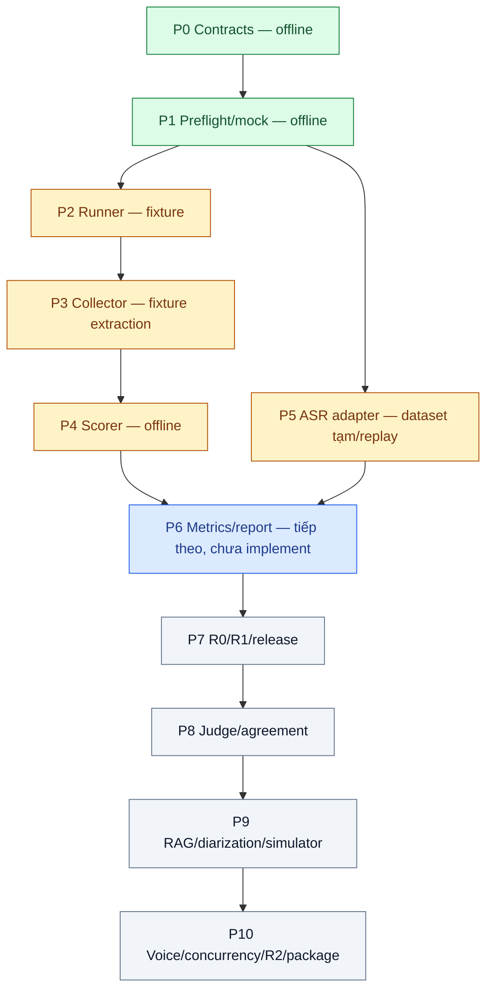

# Evaluation — bắt đầu đọc ở đây

Khu vực đặc tả, kế hoạch, contracts và tài nguyên đánh giá. Sản phẩm nằm ở `../temp-repo-for-agent/`; evaluator nối sản phẩm qua adapter, không dựng Agent thay thế để tạo điểm.

Bản đồ workspace và phân nhóm folder: [README ở root](../README.md). Mở [workspace hiện hành](../SUDO_PROJECT_MAIN.code-workspace); Evaluation là nhóm01, Product nhóm02, BTC Downloads nhóm03. Đường dẫn vật lý và toàn bộ pins/runs giữ nguyên.

## Checkpoint — tạm dừng ngày 04/10/2026

**User yêu cầu tạm dừng và lưu tiến độ; chỉ tiếp tục implementation khi user yêu cầu lại. Không tự chạy P6, model hoặc benchmark trong thời gian tạm dừng.**

- Đã implement P0–P4 offline và P5 trên dataset tạm. Kiểm tra gần nhất:84 tests evaluator +15 tests ASR đạt; checker5schemas/51valid/18invalid/18semantic mutations/86BTC records/46source hashes đạt. Run P2/P3/P4 đã đóng vẫn đúng hash; không sửa nguồn BTC hoặc sản phẩm/DB.
- P5 dùng registry `datasets/p5-current/registry.json`, settings `p5-settings.example.json`, synthetic-v1 dev4/eval20 và Medium baseline dev lock. Replay eval20/20; không chạy inference mới, không đo tốc độ mới. Human review vẫn0/20, `benchmark_ready=false`; Frozen/C.1 chưa đủ. User cho dùng dataset hiện tại và bỏ review làm blocker cho bộ tạm; sẽ bổ sung bộ đúng sau. Waiver không áp dụng cho audit/judge/PII/authority hoặc release khác.
- Evidence mốc hiện tại: [P4 score](runs/p4-fixture-review-20261004-02/score-report.json), [P5 readiness](runs/p5-current-readiness-20261004-02/dataset-readiness.json), [P5 ASR replay](runs/p5-current-asr-replay-20261004-02/asr-suite-report.json). P4 fixture FAIL+INCOMPLETE là expected; P5 pipeline COMPLETE không phải quality/benchmark PASS.
- Còn làm: P6metrics/table/benchmark M1 một lệnh; P7compare R0/R1/release; P8judge/human agreement; P9RAG/diarization/simulator; P10tool/voice/concurrency/R2/đóng gói. Công thức/matcher tool accuracy đã có ở các phase trước, nhưng chưa phải toàn bộ suite P10.
- Dependency nghiệm thu còn thiếu: Agent/runtime adapter thật, memory/DB isolation, extractor/model audit, GT/tool labels/PII, timing/usage và dataset đúng. `validate_scenarios.py` +audio BTC đầy đủ tiếp tục deferred theo user; không tự xin/tải/sinh thay thế.



**Khi tiếp tục:** đọc README này (quyết định/phần bảo vệ/P5) → [implementation plan](evaluation-implementation-plan.md), đặc biệt P6 → report-schemas/matrix/acceptance liên quan → code `eval_harness` và tests P0–P5. Kiểm conflict/dependencies P6 trước khi code; tái sử dụng scorer/metrics đã có, không sửa dataset/run lịch sử để đủ ngưỡng. Dùng bộ tạm nếu user chưa thay bộ đúng, mọi output phải là run/revision mới. Lệnh tái kiểm: `evaluation/asr/.venv/bin/python -B evaluation/run_eval.py check`.

## 1. Quyết định hiện hành — 04/10/2026

Các quyết định nhóm dưới đây thay thế cách diễn giải cũ; không thay nguồn/scorer/GT BTC:

- Implement **M1 trước, M2 sau**, theo [P0–P10](evaluation-implementation-plan.md). P2 raw runner đã có; plan tổng thể chưa phải evaluation đầy đủ đã tồn tại.
- **Tool-Call Accuracy:** `100 × TP / (TP + FP + FN)`, matching invocation name/args một-một theo thứ tự. Tool business error vẫn có thể TP; execution failure chấm riêng. Formula hiện hành `tool-accuracy.v2`; v1 là định nghĩa cũ, không dùng cho run mới.
- **Cost/call:** tổng runtime cost của cohort, kể cả call lỗi, chia số call hoàn tất. Completed = lifecycle kết thúc + after-call barrier hoàn thành, không phải TSR PASS. Denominator0 → undefined. Judge/simulator cost riêng.
- **Tạm hoãn:** xin/tích hợp `validate_scenarios.py` và **audio/segments BTC đầy đủ**. Không viết validator thay thế cùng tên, không xin/tải/sinh audio BTC trong scope hiện tại. Schema/ID/input/preflight tối thiểu và ASR/audio team vẫn phải làm.
- Deferred khai báo **trước run**, reason `DEFERRED_BY_USER_2026_10_04`, trong scope sidecar tham chiếu từ manifest `sources`. Không thêm suite ID/status ngoài schema. `asr_ids` chỉ là audio team của cohort hiện tại; yêu cầu BTC đầy đủ nằm trong deferred list riêng. Không rút expected IDs sau run.
- Có thể COMPLETE trên **scope hiện tại** nếu đủ mọi suite đăng ký, nhưng report phải liệt kê deferred và ghi **chưa nghiệm thu toàn bộ yêu cầu BTC audio**. Deferred không được gọi PASS hoặc BTC N/A; readiness toàn bộ đề vẫn incomplete. Không dùng report scope hiện tại để cấp release tuyên bố đạt toàn bộ đề.
- Các tranh chấp GT/mock/scorer vẫn giữ disputed/hold; hoãn B14 không giải quyết các tranh chấp khác.
- **P5 dùng dataset tạm theo user:** triển khai bằng dữ liệu hiện có, không chờ bộ đúng hoặc review. Waiver `USER_SKIP_REVIEW_TEMPORARY_DATASET_2026_10_04` chỉ cho registry `provisional=true`; không đổi GT thành `human_verified`, không miễn source/PII gate, extractor audit, judge agreement hoặc quyền release. User sẽ bổ sung bộ đúng bằng version/lock/run mới. Thiếu quota Frozen/C.1 ghi readiness INCOMPLETE nhưng không chặn chạy ASR bộ tạm.

## 2. Thứ tự đọc trước khi code

1. **README này:** scope, quyết định, phần bảo vệ và trạng thái thật.
2. **[Implementation plan](evaluation-implementation-plan.md):** P0–P10, đầu ra/gate và dependencies; chỉ code phần được giao.
3. **Nguồn BTC pin:** [README](evaluation-contracts/sources/btc/README.md), [điều chỉnh](evaluation-contracts/sources/btc/DIEU-CHINH-DE.md), [mentor](evaluation-contracts/sources/btc/GIAI-DAP-MENTOR.md), [scenario format](evaluation-contracts/sources/btc/schemas/scenario_format.md). README nhắc tên file không chứng minh đã nhận file.
4. **[Flow đầy đủ](evaluation-flow.md):** lifecycle/hành vi; [runner flow](evaluation-runner-flow.md) chỉ là tóm tắt.
5. **Contracts:** toàn bộ [matrix](evaluation-contracts/schema-contract-matrix.md), [reports/formulas](evaluation-contracts/report-schemas.md), [acceptance](evaluation-contracts/harness-acceptance-tests.md), rồi schemas/defs liên quan, examples, fixtures và checker. Docs hiện hành v1.1.0; TimingEvidence mới dùng schema_version1.1.0, vẫn hỗ trợ legacy1.0.0; artifacts/grading khác còn1.0.0. Wire BTC không đổi.
6. **Code BTC:** [scorer](evaluation-contracts/sources/btc/eval/reference_eval.py), [mock tools](evaluation-contracts/sources/btc/eval/mock_tools.py), trace/brief/tool schemas và 7 public samples. Hiểu giới hạn trước khi viết supplemental.
7. **Theo phần:** ASR đọc [README](asr/README.md), runner/text-processing/tests; judge đọc rubric; RAG đọc policy/qa labels; simulator đọc spec/personas. Đọc [Exemplar](exemplar-bank-design.md), [Reflection/A/B](reflection-ab-design.md) khi runtime dùng cơ chế đó.
8. **Lịch sử khi cần:** `can_sua.md`, `tong_quan_de_bai_va_btc.md`, `phan_cong_btc_va_nhom.md`, `temp-repo-for-agent/docs/flow.md`, `.archive/`, hình/HTML cũ. Không dùng điểm audit hay hành vi cũ override mục1.

Quyền quyết định: BTC quy định yêu cầu chính thức; mục1 chốt scope/công thức nhóm; contracts chốt wire/validation; flow chốt hành vi; plan chốt thứ tự. BTC khác nhóm → official nguyên bản + supplemental riêng. Conflict chưa chốt → ghi issue và hỏi, không chọn ngầm để PASS.

## 3. Dùng lại tài nguyên

Inventory: 40 parent/96 variants, **13 KM**, 50 CRM customers, 14 policy docs/99 chunk IDs, 60 RAG questions, 12 personas; **7 scenarios/13 calls/39 turns, 3 hard cases**; ASR **D01–D04/34 turns**, chưa có BTC WAV/segments. Dùng count thực, không count README.

Scorer BTC đã chấm quality/hard/guardrails/memory heuristic/Calls-to-Close/latency/ASR/RAG. Mock đã có 9 business tools: chỉ bọc/log/cô lập state, không viết lại logic giá/KM/COD. `make_example_trace.py` tạo đáp án từ GT và latency ngẫu nhiên, **không phải runner**. Traces/report mẫu chỉ dùng compatibility/regression.

Nguồn mặc định: `evaluation-contracts/sources/btc/` + `sources.lock.json`. `BTC-Data-Vong1-TEAMS/` trong evaluation là snapshot tham khảo tương đương. Root `../BTC-Data-Vong1-TEAMS/` là symlink Downloads có thể thay đổi, chỉ đối chiếu, không tự cập nhật benchmark. Rubric root khác một newline cuối file, semantics không đổi; hash phải theo bytes đã pin.

## 4. Tuyệt đối không đụng trong implementation thông thường

- **Nguồn BTC:** `evaluation-contracts/sources/btc/**`, `sources.lock.json`, `BTC-Data-Vong1-TEAMS/**`, root symlink/target. Không sửa scorer/mock/labels/policy/schemas/traces mẫu để hợp Agent. Bản BTC mới phải có snapshot/lock/provenance mới, giữ bản cũ.
- **Đề/thiết kế gốc:** PDF, `temp-repo-for-agent/docs/flow.md`, `source/flow_bach.excalidraw`, `.archive/**`. Không sửa lịch sử để giống hiện tại.
- **Evidence lịch sử:** `asr/runs/**`, model/locks, WAV, GT đã pin, raw/report run đã đóng. Không overwrite, sửa digits/transcript/labels sau điểm; tạo run/revision/dataset version mới.
- **Hình render:** `output/**` là artifacts thiết kế, không machine contract/benchmark. Không sửa generated PNG/SVG/HTML bằng tay. Hình cũ có thể khác text hiện hành; dùng text/contracts. Muốn cập nhật hình phải sửa nguồn hiện hành, render/verify riêng.
- **Ngoài scope:** không sửa sản phẩm `../temp-repo-for-agent/`, gọi TTS có phí, tải model mới, gửi production PII hoặc tạo đơn thật nếu chưa được giao/cho phép.

Được sửa có kiểm thử: docs nhóm hiện hành, plan, contracts nhóm, fixtures/checker và evaluator khi được giao. Schema đổi phải version + positive/negative tests + hỗ trợ artifacts cũ, không đổi source hashes.

## 5. Invariants

- Full/baseline cùng inputs/model/prompt/tools/catalog/KB/hardware, state riêng mỗi scenario/config; seed1lần, await after-call. Baseline giữ working context.
- Oracle chỉ scorer/simulator nội bộ; Agent/extractor không thấy gold. Feed đúng ASR lỗi/teencode.
- Raw trước validation; role/hash/pointer/span thật; args đúng không chứng minh success. Không fake evidence.
- Official/supplemental riêng; judge không cứu hard FAIL. Giữ FAIL+INCOMPLETE.
- Expected coverage pin trước run; không drop missing/duplicate/disputed. Deferred trước run khác missing trong cohort đăng ký.
- Warm-up chỉ loại derived timing, không loại quality. Filler không phải model TTFT; nonstream TTFT=Total.
- Frozen/Growth riêng; không auto-learn/auto-active giữa benchmark. Approval/hash/evaluation đúng candidate; evaluator không publish production.

## 6. Kiểm tra và trạng thái thật

Từ workspace root, môi trường có dependencies:

```sh
python3 -B evaluation/evaluation-contracts/check_contracts.py
```

Máy hiện tại có thể dùng environment ASR sẵn:

```sh
evaluation/asr/.venv/bin/python -B evaluation/evaluation-contracts/check_contracts.py
```

Checker offline chỉ schemas/examples/fixtures/semantics/hashes. PASS không phải runner/Agent/A01–A18 PASS. ASR đã có runner và TTS runs lịch sử, human listening còn pending. CLI hỗ trợ `check` P0–P5, `preflight`, P2 `run`, P3 `collect`/`export-trace`, P4 `score`, P5 `dataset-readiness`/`asr-suite`. Extractor hiện chỉ fixture replay; model extraction, benchmark/compare/acceptance pipeline và integration Agent thật chưa hoàn tất.

### P0 — code và lệnh đã có

```sh
evaluation/asr/.venv/bin/python -B -m evaluation.eval_harness check
# Entry point tương đương, dùng được từ cwd khác:
evaluation/asr/.venv/bin/python -B evaluation/run_eval.py check
# Chạy riêng tests:
evaluation/asr/.venv/bin/python -B -m unittest discover -s evaluation/tests -v
```

Có thể thay interpreter bằng Python ≥3.10 đã cài `evaluation-contracts/requirements.txt`. `check` chạy offline, không gọi model, không sinh benchmark run; report BTC CLI chỉ ghi vào TemporaryDirectory rồi tự dọn. Source inventory/hash được kiểm trước và sau tests. Exit codes riêng P0: 0=tests đạt, 1=tests lỗi/không tìm thấy tests, 3=CLI sai. Không diễn giải thành exit code chất lượng Agent.

- [contracts.py](eval_harness/contracts.py) import checker hiện có; không dựng registry/schema thứ hai.
- [metrics.py](eval_harness/metrics.py): matcher nhận **một context** đã có nhãn và toàn bộ ToolEvents của context đó. Event xếp theo `started_at` (cùng mốc giữ input order), ghép expected chưa dùng đầu tiên khớp name/args subset exact. Required match là TP; optional match và extra read-only được phép báo `allowed` riêng, không vào TP/FP/FN. `allow_extra_read_only` chỉ cho phép 5 tool đọc BTC đã liệt kê trong module, không cho tool ghi/unknown. Không chuẩn hóa SKU/giá/thời gian hoặc coi null expected args là wildcard.
- Business error vẫn TP nếu invocation đúng, nhưng nằm trong `execution_failures`; timeout/transport error nằm trong `execution_incomplete` vì chưa có reconciliation. Đây là phân loại outcome đã thu, chưa chứng minh result/side effect bằng runtime/state. Không suy success từ HTTP200 hoặc args đúng.
- Thiếu labels, null args chưa chốt, condition ngoài schema, event trùng/sai context/time/schema → lỗi, không suy labels từ actual. Caller tương lai phải kiểm coverage/evidence/điều kiện trước; log bị mất không được đưa vào như một tập hoàn chỉnh. Matcher P0 không phải suite M2/A01/A14 end-to-end.
- `cost_per_completed_call` chỉ tính số học từ tổng runtime cost đã cùng currency và số completed đã qua after-call barrier; không thu usage, chọn currency/đơn giá hoặc quyết định lifecycle. Cost thiếu→INCOMPLETE; completed0→UNDEFINED/null; cost0 có nguồn vẫn có thể MEASURED.
- [test_p0.py](tests/test_p0.py): 14 tests cho full/baseline function parity và **toàn bộ report BTC CLI**, smoke selftest subprocess, matcher, timing legacy/nullable, cost zero/missing, references fail-closed, CLI và source integrity. Mock selftest chỉ smoke, không chứng minh toàn bộ logic business.

### P1 — worker mock và preflight

```sh
# Fixture example, không phải benchmark Agent hoặc human review thật:
evaluation/asr/.venv/bin/python -B -m evaluation.eval_harness preflight --settings evaluation/p1-settings.example.json
evaluation/asr/.venv/bin/python -B -m unittest discover -s evaluation/tests -p test_p1.py -v
```

`check` giờ chạy cả P0 và P1 (`test_p*.py`), không bỏ sót tests mới. Preflight exit: 0=planned-input checks đạt, 2=issues/disputes/missing làm INCOMPLETE, 3=config/infra/CLI sai. Không coi exit0 là Agent PASS. `--out <new-report.json>` chỉ tạo file mới; file đã tồn tại bị từ chối. `--scenarios <dir>` tùy chọn, directory phải khớp toàn bộ scenario files được manifest pin, không chỉ là tập con.

Settings có 3 key bắt buộc: `asset_root` (relative tới settings file), `manifest`, `scope` (hai path relative tới asset_root), và key tùy chọn `adapter` (AssetRef). Settings P1 cũ vẫn hợp lệ; không có adapter mặc định hoặc fallback. Manifest dùng schema hiện có, ghim model/config/inputs; không đổi tùy theo điểm. Scope sidecar phải có AssetRef/hash trong `manifest.sources` trước run. Ví dụ là [p1-settings.example.json](p1-settings.example.json) → [fixture scope](evaluation-contracts/fixtures/p1-scope.json); **không dùng quyền/human review fixture cho dataset thật**.

Scope chứa:

- `deferred`: `btc.validator` và `btc.audio_segments`, cùng reason `DEFERRED_BY_USER_2026_10_04`. Không giảm expected IDs trong cohort team để giấu missing.
- `source_decisions`: SourceDecision schema hiện có, origin AssetRef thật cho từng scenario/suite asset, split/run đúng manifest, permission `allow`, purpose `report_only`. Đây là khai báo quyền đã pin, chưa chứng minh quyền reviewer/approval production.
- `pii_review`: status `approved`, `reviewed_by` và scope `synthetic` hoặc `authorized_redacted`. Review/quyền thực phải do người có thẩm quyền cung cấp; preflight không tự review hoặc sanitize PII.
- `asr_assets`: `{id, audio: AssetRef, ground_truth: AssetRef, segments?: AssetRef}` khớp exact `asr_ids`. Audio team phải WAV PCM16 mono16kHz không rỗng; GT object có đúng một dialogue ID tương ứng. Diarization áp dụng thì cần segments. Không tạo/tải audio BTC deferred.
- `rag_ids` khớp manifest; RAG áp dụng cần `rag_ground_truth: AssetRef`, giữ nguyên labels và đủ60 qids BTC. Q20/Q57 vẫn OPEN, không sửa GT. Tranh chấp được ghi vào report, không gọi là resolved.

[preflight.py](eval_harness/preflight.py) kiểm schema/hash/root-safe paths, duplicate JSON keys/nonfinite, calls liên tục, noisy input length, date override/cộng dồn, exact planned coverage hai config, grading references, suite/memory applicability, nguồn/PII khai báo và quy mô. M1 official dùng gate nhóm bảo thủ ≥20 thường đa phiên +5khó; M2≥40. Development/fixture thiếu quy mô được warning, official_eval bị INCOMPLETE. Có dispute vẫn giữ inputs và issues. Output gồm ValidationReport, coverage **plan** (chưa observed), config pin, dispute/capability report, deferred và `btc_full_readiness=INCOMPLETE`.

[environment.py](eval_harness/environment.py) tạo process **spawn mới mỗi scenario/config**, load BTC đã kiểm inventory/hash, deep-copy seed BTC một lần; `_ORDERS/_CALLBACKS/_TICKETS/_ONCE_USED` giữ xuyên call trong worker. P2 tạo/đóng worker theo lifecycle, truyền timeout từ manifest; seed_history runtime cần adapter P2, không lấy facts/GT làm seed. Chỉ inject `on` cho signature có nhận; date đối nghịch/kwargs lạ bị reject, không drop/retry. `call_tool(...)` trả bản copy result đã lọc CRM sessions cho baseline, cả candidates số điện thoại dùng chung; orders nghiệp vụ vẫn giữ.

`events`/`audit`/`snapshot()` là **evaluator-only**, có raw result/state trước-sau/time/effective args; tuyệt đối không expose cho Agent vì có thể chứa CRM sessions/PII/oracle. Worker standalone giữ audit trong memory; runner P2 lưu raw request trước invoke, flush audit/events đã thu và hash khi đóng. P3 còn phải chuẩn hóa/validate provenance/evidence trước benchmark. Business error là outcome riêng; exception/timeout không suy success. Worker timeout đóng/terminate, ghi reconciliation_required; không tạo ToolEvent giả với side_effect=false khi chưa biết commit, không tự retry/restart.

P1 chỉ chứng minh component isolation và CRM access gate. Ledger/brief/summary/cache/KB memory routes và runtime after-call barrier của sản phẩm **chưa nối/kiểm**; P2 fixture lifecycle đã kiểm, A11/A16 đầy đủ còn chờ runtime integration/P3. Không có MCP server, model call hoặc production tool trong P1. Source BTC/lock không đổi; fixture manifest nhóm có hash scope và checker tách `verify_sources()` để reuse.

### Chuẩn bị P2 — input gate và adapter

`execution_gate` tách khỏi validation: chỉ dispute ở purpose `development` không chặn thử bind adapter; dispute vẫn OPEN và validation vẫn INCOMPLETE. Dispute ở regression/official và mọi issue khác đều chặn. Không bỏ case/cohort hoặc ignore errors để chạy.

```sh
evaluation/asr/.venv/bin/python -B -m evaluation.eval_harness preflight --settings evaluation/p1-settings.example.json --for-execution
```

Ví dụ P1 chưa có adapter nên lệnh trên trả2 với `ADAPTER_NOT_CONFIGURED`, là kết quả mong đợi. Flag này chỉ kiểm input gate, không chạy Agent; exit0 chỉ cho phép thử bind, không chứng minh runtime hoạt động.

`adapter` tham chiếu descriptor có đúng4key: `kind` (`test` hoặc `runtime`), `entrypoint` (`module:factory`), `code` (AssetRef), `capabilities` (list không trùng). Descriptor và code đều phải pin trong `manifest.sources`. M1 yêu cầu `business_tools`, `memory_isolation`, `memory_read_gate`, `after_call_barrier`, `snapshots`, `briefs`, `timestamps`, `usage`. Preflight chỉ đọc/hash, không import code. P2 phải kiểm loaded code và hooks/capabilities thực trước lượt đầu; khai báo đủ chưa phải bằng chứng. Test adapter chỉ dùng fixture, không dùng official_eval hoặc thay runtime bị thiếu. Model/config lấy từ manifest, credentials từ environment.

P2 hiện lưu raw/partial execution khi lỗi; P3 extract và map sang trace BTC. Wrapper xuất trace đầy đủ phụ thuộc cả P2+P3: không điền questions/claims rỗng hoặc latency0 khi chưa có evidence. Runner lifecycle/seed/barrier đã kiểm bằng fixture; memory routes và after-call hooks của sản phẩm thật chưa nối/kiểm, chưa chạy Agent thật.

### P2 — raw fixed-turn runner đã có

```sh
# Echo fixture, không phải Agent benchmark; chọn một thư mục output CHƯA tồn tại:
evaluation/asr/.venv/bin/python -B -m evaluation.eval_harness run --settings evaluation/p2-settings.example.json --round R0 --out evaluation/runs/p2-fixture-review-01
# Chạy một nhánh: thêm --config full hoặc --config baseline_no_memory.
# Entry point từ cwd khác: python /absolute/path/evaluation/run_eval.py run ...
evaluation/asr/.venv/bin/python -B -m unittest discover -s evaluation/tests -p test_p2.py -v
```

`run` trả2 kể cả `execution_complete=true`: raw execution chưa qua collector/scorer/suites. Đọc `runner-report.json` để phân biệt execution đã đủ hay lỗi, attempted/completed/failed và missing IDs. Config/round/output không hợp lệ trả3. Không retry hoặc overwrite; muốn chạy lại chọn output mới, benchmark runtime phải pin run_id/namespace mới. `--scenarios` phải khớp directory được manifest pin, không auto-import bộ ẩn chưa có manifest/quyền nguồn.

Mỗi scenario/config có adapter process và BTC worker riêng. Code adapter chạy từ bytes đã hash trong snapshot; không import module cài sẵn cùng tên. Bind kiểm live capability list, callable/signature5hooks và retry declaration; **không chứng minh SDK retry hoặc isolation của DB/cache/KB thật**. Fixture kiểm hành vi, runtime deployment còn cần integration evidence. Adapter là code tin cậy, process isolation không phải security sandbox.

`factory()` trả instance với `capabilities` và `retry={"agent":0,"tool":0}`. Hooks sync hoặc async, các hook async dùng cùng event loop xuyên scenario để giữ client/future và await barrier:

- `open_scenario(context)`: seed_history có provenance, namespace, configuration/resources và hai callbacks `call_tool(name,args)`/`emit(raw_event)`. Chỉ gọi một lần. Adapter phải seed một lần và không đưa history bị chặn vào prompt Agent; gold/labels không được truyền. Callback tool chỉ trả visible result, không trả evaluator audit/state.
- `start_call(context)`: identity/channel/date/input mode và memory-read policy; trả `{memory_snapshot: object, call_brief: object|null}`, giữ raw object/timestamps để P3 phân biệt invalid/missing. Không dùng notes/persona/GT làm câu trả lời.
- `run_turn(customer_text)`: trả object có `agent_text` string thực; backend timing/usage và emitted events giữ nguyên, thiếu thì null + reason, không tạo0. Working context phải giữ xuyên turn.
- `end_call()`: await memory commit, trả `{completed:true, barrier_complete:true, memory_snapshot:object}`. Thiếu/false/timeout không tính completed và không chạy call tiếp trong scenario. Outcome nghiệp vụ không phải điều kiện completed.
- `close_scenario()`: cleanup namespace của scenario, không đụng production. Lỗi không-timeout được thử close có timeout; timeout giết process và giữ reconciliation pending, không tự restart/cleanup state ngoại vi khi chưa biết commit.

Layout P2: `manifest.json`, `preflight.json`, `execution-plan.json`, `runner-report.json`, `inputs/` (verified source bytes, chỉ evaluator đọc), `sources.lock.json` (base `inputs/`), `artifacts.lock.json` (hash file đã đóng). Mỗi config có `raw-execution.jsonl`, `tools.jsonl` và `adapter-N.log`. Raw request/result/emitted events/snapshots append-only, flush khi thu; malformed output giữ trong raw rồi báo lỗi, không vào scorer. Các envelope raw/runner report là staging P2, **không giả làm schema Brief/Memory/Timing/Coverage đã chuẩn hóa**; P3 phải chuyển sang contracts hiện có. Cấp quyền đọc local raw theo PII review, không upload audit/seed cho model.

[p2-settings.example.json](p2-settings.example.json) pin descriptor/code fixture và [p2-manifest](evaluation-contracts/fixtures/p2-manifest.json), giữ example P1 cũ nguyên vẹn. Echo fixture không giải bài nghiệp vụ, không cung cấp production memory store, không tạo GT/predictions hoặc điểm chất lượng. Các ca P2 được test:13turn noisy, seed once, barrier ordering/timeout, baseline working context, state xuyên call/isolation full-base, bind failures, partial invalid output, CLI/no-overwrite và lost reply sau BTC commit không retry.

Kiểm tra thực tế 04/10/2026: checker đạt5schemas/51valid/18invalid/18semantic mutations/86BTC records/46source hashes; P0 đạt14unit tests, P1/pre-P2 đạt18tests (14component +4input-gate/config), P2 đạt10fixture/fault integration tests, tổng42; ASR `test_asr.py` đạt15unit tests (không chạy model). Nguồn BTC có ResourceWarning về file handle khi chạy tests; không sửa source để dập warning. Không suy ra benchmark/visual QA đã chạy.

Sau mỗi phần: checker → tests phần đó → fixture integration → runtime thật khi đủ capabilities. Ghi đã sửa/kiểm gì, chưa chạy/deferred gì. Không suy ra fixture xanh là hệ thống đạt đề.

### P3 — collector offline và fixture extraction

Đọc [collector.py](eval_harness/collector.py), [extractor.py](eval_harness/extractor.py), [test_p3.py](tests/test_p3.py) sau contracts/plan. Không sửa nguồn BTC, lock hay raw run cũ. Mỗi replay tạo revision mới, kiểm closed-file inventory/hash trước và sau, snapshot raw để truy vết bằng JSON Pointer thật. Raw P2 mới thêm scope/phase; raw cũ vẫn đọc được nhưng thiếu typed snapshots không được bù bằng dữ liệu suy đoán.

```sh
# Chọn các output CHƯA tồn tại; đây là scripted fixture, không gọi model/DB.
evaluation/asr/.venv/bin/python -B evaluation/run_eval.py run --settings evaluation/p3-settings.example.json --out evaluation/runs/p3-raw-new
evaluation/asr/.venv/bin/python -B evaluation/run_eval.py collect --run evaluation/runs/p3-raw-new --extractor fixtures/p3-extractor.json --audit-seed 42 --out evaluation/runs/p3-evidence-new
evaluation/asr/.venv/bin/python -B evaluation/run_eval.py export-trace --run evaluation/runs/p3-evidence-new --config full --out evaluation/runs/p3-export-new/full.jsonl
```

`run`/`collect` fixture trả2 là expected; `export-trace` trả0 khi đủ wire/schema/coverage, **không phải Agent đạt chất lượng**. Collect:1 confirmed violation,2 incomplete,3 config/integrity error. Export thiếu cohort trả2 và không tạo file; không xuất tập con như đủ coverage. CLI kiểu BTC một lệnh `--scenarios ... --out trace.jsonl` chưa có; hiện dùng ba bước trên.

Descriptor extractor/records/schema/implementation hash phải pin trước execution, version khớp manifest. Fixture replay chỉ cho synthetic/development, không fallback vào official/runtime. Input hash chỉ actual Agent/consultant/tool-request texts, không GT/memory/oracle result. Không có annotation cho actual input thì missing, không tự tạo predictions rỗng. Quote offsets theo Unicode code points; consultant/tool claims không vào Agent claims, fact tồn tại trong memory không tự thành facts_used; giữ nguyên value sai.

Adapter bổ sung P3: start/end/turn trả `memory_snapshot` có customer_id/namespace/facts/writes; fact có key/value/customer_id/source/valid_from/valid_until/state, write có key/value/op/source/customer_id. Source actual text dùng `{context,field:"customer_text"|"agent_text"}`; seed dùng pinned AssetRef trỏ seed_history. Turn snapshot writes là writes thực của turn, không cumulative call. Scenario có `memory_expectation` cần after_turn evidence; không suy writes turn trước từ after_call. Backend trả request_at/completed_at/first_token_at, mode streaming/nonstream, usage thật hoặc missing. Nonstream được dùng completed_at làm TTFT theo BTC; streaming thiếu first_token không điền0. Brief raw được giữ cả invalid; timestamps identified_at/brief_ready_at phải thu thật. Handoff có emitted metadata kind=handoff_brief/object/identified_at/ready_at để không suy thời gian từ tool result.

Output: transcripts, typed tools/memory/timing/brief/extraction sidecars, cache raw replay, coverage/validation, full.jsonl/baseline.jsonl, extractor-audit.json và artifacts.lock.json. Audit lấy tối đa20 turn theo seed, reviews luôn pending cho người chấm độc lập; chưa có importer/review gate hoặc model extractor thật. S01–S24/A01–A18 runtime chưa nghiệm thu. Usage/cost fixture thiếu giữ INCOMPLETE; P4 score đọc revision P3, không sửa collector report cũ. DB/RAG/product adapter chưa sửa.

Run kiểm tra: [collector report](runs/p3-fixture-evidence-20261004-01/collector-report.json), [validation](runs/p3-fixture-evidence-20261004-01/validation.json), [audit](runs/p3-fixture-evidence-20261004-01/extractor-audit.json). 4/4 trace wire hợp lệ,12 memory records; human audit và usage còn thiếu. Nguồn BTC46hash và15test ASR giữ nguyên; tổng test P0–P3 ghi theo kết quả `check`, không dùng report fixture thay benchmark.

### P4 — BTC scorer wrapper và supplemental offline

Đọc [report contracts](evaluation-contracts/report-schemas.md) → [grading schema](evaluation-contracts/grading-contract.schema.json) → [scoring.py](eval_harness/scoring.py) → [test_p4.py](tests/test_p4.py). Không thay công thức/file BTC, không sửa lock hay evidence run cũ, không dựng DB mới hoặc tự gọi Agent/model để lấp thiếu evidence.

```sh
evaluation/asr/.venv/bin/python -B evaluation/run_eval.py score --run evaluation/runs/p3-fixture-evidence-20261004-01 --out evaluation/runs/p4-review-new
evaluation/asr/.venv/bin/python -B -m unittest discover -s evaluation/tests -p test_p4.py -v
```

Input là revision P3 đã đóng/hash, phải có nhánh full; baseline optional. P4 snapshot evidence, kiểm inventory/hash/refs/context/role/quote/mapping, coverage theo manifest và gọi BTC CLI nguyên bản bằng subprocess. `official-report.json` giữ bytes BTC sinh, không sửa CCR/TSR/HR/Calls-to-Close. `scorer-invocation.json` ghi argv, source hash, wrapper hash, stdout/stderr refs, exit code và diagnostic_only. Partial/invalid rows bị loại khỏi scorer input nhưng không khỏi coverage; duplicates không âm thầm dedup. BTC report diagnostic không override supplemental gate.

Output mới có official-report.json, supplemental-report.json theo schema, validation/coverage, assertion-details, verified-orders mỗi config, score-report và artifacts.lock. Scorer timeout/nonzero/schema error giữ log + SCORER_INFRA; không tạo official giả hoặc supplemental link tới report không tồn tại. Exit1 = confirmed FAIL (kể cả còn thiếu),2 = INCOMPLETE,3 = config/integrity error; exit0 chỉ scope checks PASS+COMPLETE, không nghiệm thu toàn đề.

Supplemental kiểm riêng business-error/unknown execution, audit before-after/side effect, new order đúng result/args/state (không tính seed), callback/ticket result trong state; fact carryover value/GT, claim ngoài GT, memory profile/namespace/multiple-active/TTL/delete/set/supersede, brief schema/profile/fact. Kiểm TTL theo ngày virtual call, không theo wall-clock chạy benchmark. Profile/state DB thật vẫn cần product adapter xuất snapshot/verifier phù hợp; hiện state proof dành cho mock BTC.

Grading checks reuse schema: schema, tool_success, memory, fact_value, claim_grounding, guardrail và tool_accuracy. `schema.artifact_role=tool_args` kiểm named request `name+args` theo ToolArgs, hỗ trợ fragment qua registry offline. `tool_success.expected_status=success` đối chiếu outcome; giá trị khác đối chiếu result.status, không dùng HTTP200. `fact_value.expected_source` trỏ value GT; `claim_grounding.ground_truth` trỏ map field→value. Guardrail là regex policy được pin, không là PII detector tổng quát. Memory flat map đối chiếu active facts sau call; superseded hỗ trợ map slot→old_value, must_not_write_to hỗ trợ customer_id hoặc list. Các shape khác/address_ttl_check/profile_state chưa có semantics đủ rõ giữ INCOMPLETE, không đoán.

Tool labels phải là ExpectedToolCalls đúng run/config/scenario/call/turn được pin trước execution; không suy nhãn từ actual invocation/success_if, không đổi config nhãn full sang baseline. Metric TCA chỉ trên context được label, không tự nhận coverage toàn run. Missing labels/PII policy/GT, disputed GT và judge-only/hybrid chưa có judge giữ INCOMPLETE. Confirmed FAIL không bị pending judge đảo ngược. Handoff prose/content review còn pending; schema/identity/fact checks không chứng minh toàn bộ summary đúng.

Run fixture P4: [score report](runs/p4-fixture-review-20261004-02/score-report.json), [official](runs/p4-fixture-review-20261004-02/official-report.json), [supplemental](runs/p4-fixture-review-20261004-02/supplemental-report.json). FAIL+INCOMPLETE là expected: fixture cố ý dùng room30 thay GT25; BTC CCR100% chỉ theo tên fact.13 test P3 và13 test P4 cùng42 test P0–P2 =68; ASR15test; chưa phải A01–A18 end-to-end. Sau này cần GT/labels/policy đã review, runtime/model extractor/human audit/usage để nghiệm thu; P5/P6 dataset/metrics, P8 judge và P9 RAG vẫn riêng.

### P5 — dùng bộ hiện tại, thay bộ đúng sau

Đọc theo thứ tự: mục1 → plan P5 → [ASR README](asr/README.md) và `asr/run_eval.py`/`text_processing.py` → [settings](p5-settings.example.json) → [registry](datasets/p5-current/registry.json) → `eval_harness/datasets.py`, `asr_suite.py`, `tests/test_p5.py`. Không sửa nguồn BTC, runner/GT/WAV/models và runs ASR lịch sử để hợp adapter.

Registry `p5-inputs-v1` và report readiness/suite là **staging P5**, không phải Manifest/OfficialReport/SupplementalReport. `coverage.json` và `validation.json` dùng contracts hiện có. Không đổi contracts/schema hashes P0–P4. ASR metrics lấy nguyên BTC scorer qua runner cũ; không viết công thức WER/CER mới. P6 sẽ làm aggregation/comparison/table, không lấy status pipeline để cấp release.

```sh
# Chọn tên output mới mỗi lần, không overwrite:
evaluation/asr/.venv/bin/python -B evaluation/run_eval.py dataset-readiness --settings evaluation/p5-settings.example.json --out evaluation/runs/p5-readiness-new
evaluation/asr/.venv/bin/python -B evaluation/run_eval.py asr-suite --settings evaluation/p5-settings.example.json --split eval --mode replay --out evaluation/runs/p5-replay-new
# Chỉ chạy khi muốn inference local thật; không tải model, không gọi TTS/API:
evaluation/asr/.venv/bin/python -B evaluation/run_eval.py asr-suite --settings evaluation/p5-settings.example.json --split eval --mode infer --out evaluation/runs/p5-inference-new
```

- Bộ tạm ghim 1 development fixture/2call, synthetic-v1 dev4/eval20 WAV PCM16 mono16kHz, GT/hash và Medium baseline dev lock. Model chọn **explicit**, không rơi vào default Small. Transcript lịch sử Medium là dữ liệu đã xem, chỉ regression/replay; giá minh họa synthetic không được dùng làm GT nghiệp vụ BTC. Không sinh thêm scenario/audio để lấp quota.
- `dataset-readiness`: exit2 hiện tại là expected vì provisional/Frozen0/C.1 chưa có inventory; `execution_gate.allowed=true` cho phép ASR bộ tạm. Missing/corrupt WAV, split leak, sai lineage và review bắt buộc chưa đủ chặn suite trước subprocess. Sai config/hash/lock trả3, không fallback model/dataset.
- `asr-suite`: exit0 chỉ coverage/integrity pipeline COMPLETE, không phải ASR quality đạt đề. Exit2 giữ partial logs/raw và toàn bộ expected IDs khi native runner lỗi/thiếu hypotheses. Replay mặc định reextract từ hypothesis thật, không từ GT; không gọi model, timing mới là `null`, không nhập timing lịch sử vào phép đo mới. Inference explicit kiểm model/runtime/code/scorer/lock, native runner vẫn kiểm lại config trước nhận dạng; timing warm-up không loại quality.
- Output gồm `inputs/` verified snapshots (không copy model weights), `native-input/`, `native-asr/` nguyên bản, invocation/stdout/stderr, readiness, typed coverage/validation, suite report và `artifacts.lock.json`. Readiness AssetRefs relative tới `source_asset_root`, bản bytes tương ứng lưu dưới `inputs/`; coverage/validation/suite refs relative tới output root. Missing/corrupt input không giả snapshot hợp lệ. Model weights chỉ giữ hash; dữ liệu raw chứa phone nên giữ local như assets hiện có.
- Thay bộ đúng: tạo folder/version registry và settings mới; ghim AssetRef SHA256 cho GT/audio/manifest/config, giữ dev/eval/Growth/customer IDs riêng. Khai `replay:null` khi chưa có historical hypotheses (dùng infer explicit); nếu replay phải ghim đúng manifest/GT/audio và hypotheses cùng cấu hình dev. Chốt model trên dev bằng runner hiện có, pin lock + model source trước eval, không tune trên eval rồi gọi holdout. Không sửa registry/run cũ sau điểm. Muốn bật review gate đặt `review_policy.required=true` và cung cấp status human review thật; không tự gán verified. Quota Frozen/C.1 vẫn cần bổ sung riêng, không suy C.1 từ 20 audio eval.

Kiểm thử 04/10/2026:16 tests P5 registry/readiness/replay/coverage/faults/CLI, tổng P0–P5 **84 tests đạt**; ASR **15 tests đạt**, checker46source hashes nguyên vẹn. Inference branch chỉ kiểm invocation/lock bằng test mock, chưa chạy model mới. Run kiểm tra bộ tạm xem [readiness](runs/p5-current-readiness-20261004-02/dataset-readiness.json) và [ASR replay](runs/p5-current-asr-replay-20261004-02/asr-suite-report.json):20/20 coverage, human review0/20, benchmark_ready=false, không số đo tốc độ mới. P3 audit, P4 GT/labels/PII/state, P6metrics, P8judge, P9RAG và runtime DB vẫn pending riêng; waiver P5 không xóa các issue đó.
