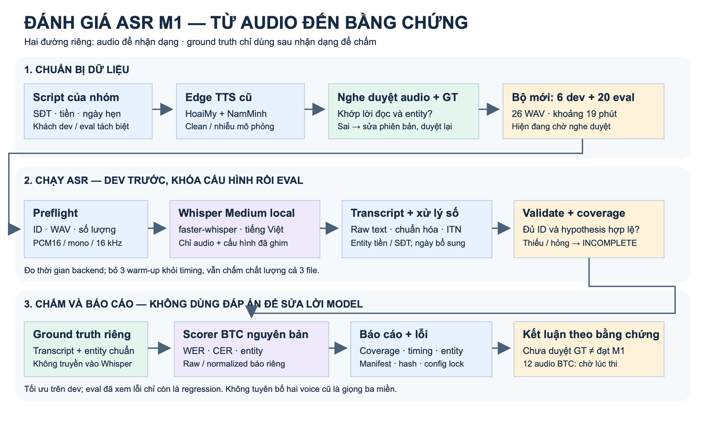
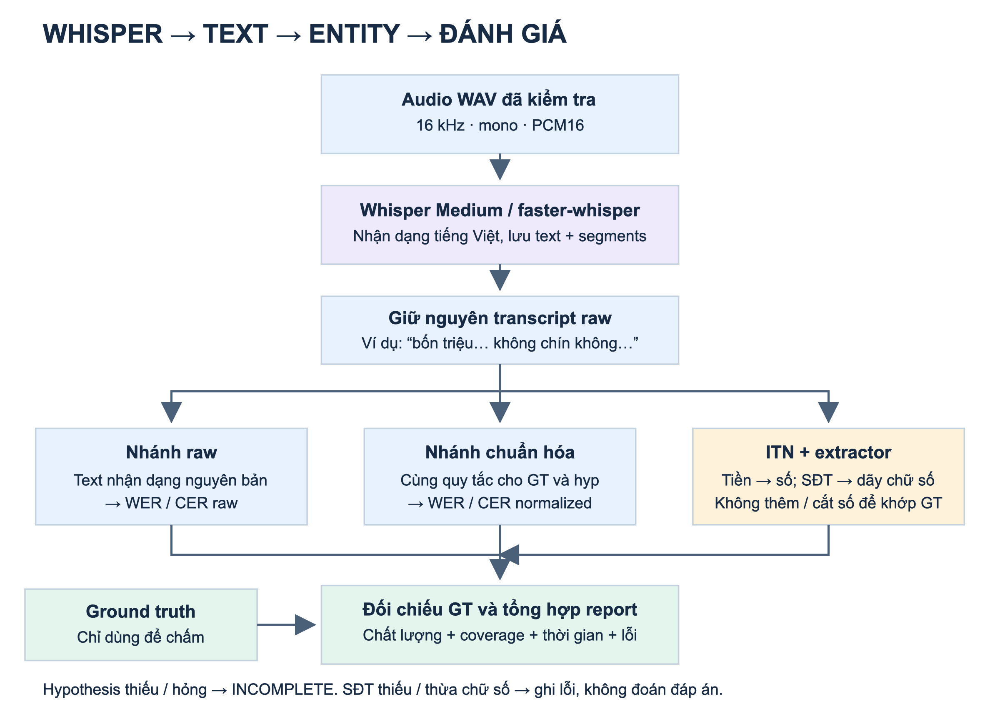

# Flow ASR để thuyết trình

## 1. Toàn cảnh

[Mở hình vector để zoom](asr-flow.svg)

## 2. Chi tiết xử lý

[Mở hình vector để zoom](asr-processing.svg)

## 3. Lời trình bày khoảng một phút

“Phần ASR đánh giá xem hệ thống nghe tiếng Việt chính xác đến đâu. Nhóm chuẩn bị script rồi sinh audio bằng hai giọng Edge TTS cũ, có cả bản sạch và nhiễu mô phỏng. Audio và đáp án cần được nghe duyệt trước khi kết luận chất lượng.

Sau đó audio được kiểm tra định dạng và đưa vào Whisper Medium chạy local. Model chỉ nhận audio và cấu hình, không nhận đáp án. Kết quả được lưu nguyên bản, rồi xử lý theo hai hướng: chuẩn hóa lời nhận dạng để đo lỗi từ, lỗi ký tự; và chuyển số nói thành entity tiền, số điện thoại để kiểm tra tính đúng của thông tin.

Cuối cùng scorer BTC đối chiếu với ground truth, xuất báo cáo chất lượng, độ đầy đủ dữ liệu, thời gian và các lỗi cụ thể. Nhóm thử và tối ưu trên dev trước, khóa cấu hình rồi mới chạy eval. Nếu thiếu audio hoặc kết quả, báo cáo phải ghi chưa đầy đủ, không coi là đạt.”

## 4. Công nghệ và trạng thái thật

- **Edge TTS:** sinh tiếng nói tổng hợp; HoaiMy cho agent, NamMinh cho khách. Không chứng minh được ba miền.
- **PyAV / NumPy:** chuyển PCM16 mono 16 kHz, ghép lượt thoại, thêm nhiễu mô phỏng; không phải nhiễu ghi âm thực tế.
- **Whisper Medium + faster-whisper:** nhận dạng tiếng Việt local; không phải PhoWhisper và không dùng FPT API.
- **Python normalizer / ITN:** chuẩn hóa text và trích số. Ngày hẹn là phép đo bổ sung, không gộp thành metric chính thức BTC.
- **Scorer BTC:** giữ nguyên mã nguồn; báo raw và normalized thành hai view riêng.
- **JSON Schema + manifest/hash:** kiểm cấu trúc hypothesis, liên kết ID và ghi cấu hình để tái lập; không thay thế nghe duyệt hoặc kiểm tra ngữ nghĩa.

**Bộ mới:** 26 audio, 6 dev + 20 eval; khoảng 18,94 phút, 1 dev + 4 eval nhiễu. Đã sinh, chưa nghe duyệt và chưa chạy Whisper trên bộ này. Không mang kết quả 12/20 SĐT của bộ cũ sang bộ mới.

**Giới hạn:** 12 audio BTC chưa nhận; audio TTS không thay thế toàn bộ yêu cầu dữ liệu dự án. Ba warm-up bị loại khỏi timing nhưng vẫn chấm chất lượng. Timing hiện là batch processing, không phải streaming latency/TTFA. Chưa có cơ sở tuyên bố PASS M1/M2.

## 5. File triển khai tương ứng

- Chuẩn bị audio: `../prepare_audio.py`; bộ mới: `../datasets/edge-new-v1/`.
- Nhận dạng, kiểm input, chấm và báo cáo: `../run_eval.py`.
- Chuẩn hóa và entity: `../text_processing.py`.
- Nghe duyệt: `../datasets/edge-new-v1/listen.html`.
- M2 diarization là nhánh riêng, không đưa vào flow M1 này; nhãn speaker từ lúc sinh TTS không phải kết quả model diarization.

Flow này mô tả pipeline độc lập chấm ASR, không phải toàn bộ vòng cải tiến FAQ/playbook hoặc đánh giá nghiệp vụ Agent.
