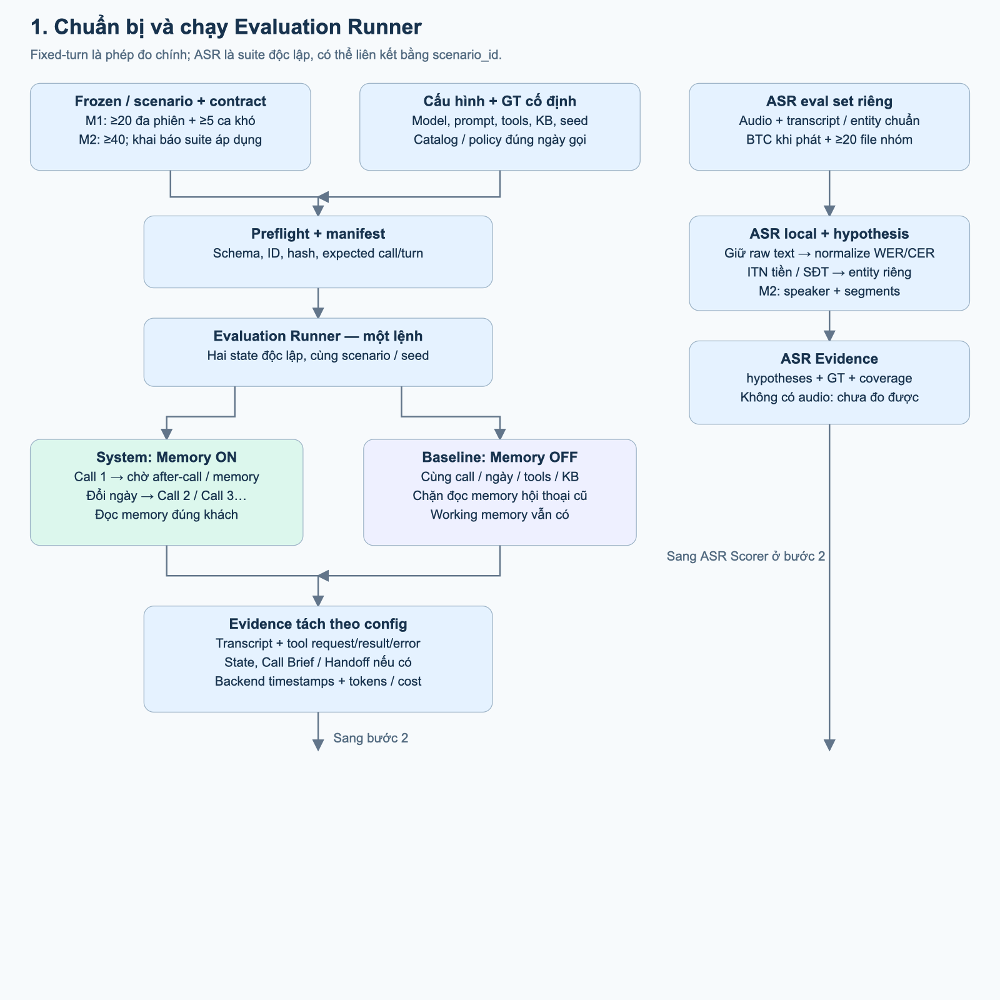
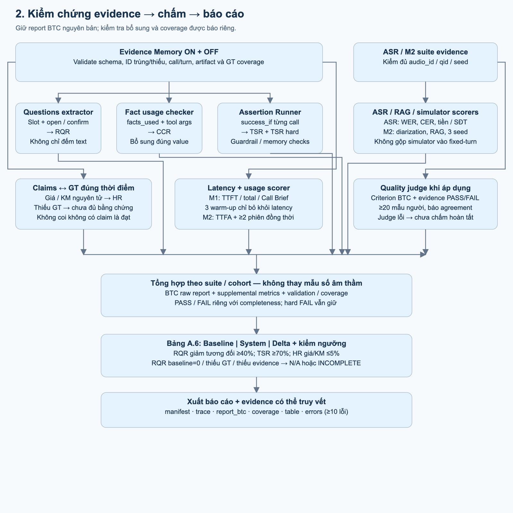
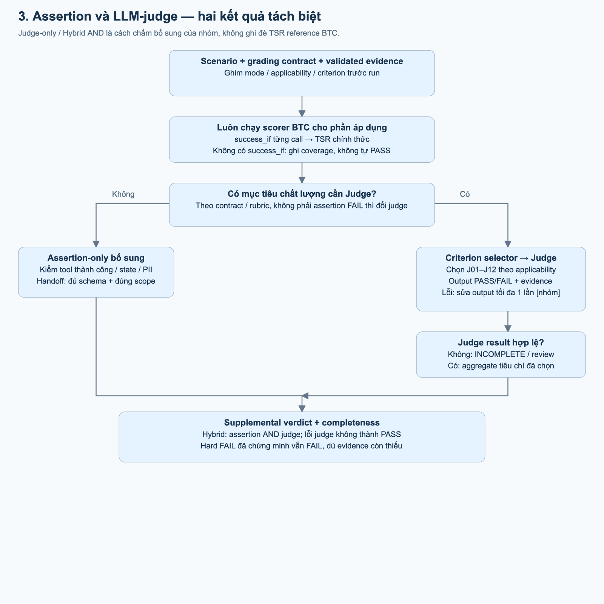

# Evaluation Runner — flow để trình bày

Quyết định hiện hành ở [README](README.md#1-quyết-định-hiện-hành--04102026), thứ tự implementation ở [P0–P10](evaluation-implementation-plan.md). Tạm hoãn validator BTC và audio/segments BTC đầy đủ; ASR team vẫn đo. Deferred khai báo trước run, report không tuyên bố đủ yêu cầu BTC audio. Tool Accuracy dùng tool-accuracy.v2 theo invocation TP/(TP+FP+FN); cost/call chia completed calls, kể cả cost failed calls ở tử số. Hình/HTML là minh họa, không override text/contracts.

Dựa trên ý tưởng trong `Evaluation_QD (1).md`: **chuẩn bị/chạy → thu evidence → chấm → báo cáo**. Chỉ mô tả Evaluation Runner, không bao gồm Knowledge Gap, Reflection, Source Gate học, duyệt FAQ hoặc release. Đây là thiết kế, không phải kết quả benchmark.

**Kiến trúc toàn cảnh bằng Archify:** [mở Evaluation Harness HTML](output/archify-runner/evaluation-harness.html). Hình nối dataset/cấu hình, Runner ON/OFF, evidence/coverage, extractors, scorer BTC, judge, ASR, các suite M2 và báo cáo. Xem các thẻ giải thích dưới hình. File HTML độc lập, dùng offline; giao diện công cụ tiếng Anh, nội dung tiếng Việt. Kiểm cấu trúc/bố cục và artifact đã đạt; kiểm trình duyệt chưa hoàn tất do lỗi khởi động Chrome, chưa có xác nhận trực quan HTML.

## 1. Chuẩn bị và chạy

Frozen là scenario để chạy Agent; ASR set là audio để kiểm khả năng nhận giọng nói. Hai tập có thể liên kết qua ID nhưng không bắt buộc là một tập. GT chỉ cấp cho scorer; không đưa đáp án vào Agent. Growth nếu chạy phải version và báo riêng Frozen.

Preflight ghim schema, ID, cấu hình, asset hash, số call/turn dự kiến và suite áp dụng. Full/baseline giữ cùng model, prompt, tools, catalog, KB và seed nghiệp vụ; state tách riêng. Baseline chỉ chặn đọc memory hội thoại phiên trước. Call đầu chỉ cold khi không có seed history được phép; sau mỗi call phải chờ after-call trước khi đổi ngày và chạy call kế tiếp. Dùng input ASR lỗi nếu scenario quy định, không thay bằng transcript sạch. Fixed-turn không bị giới hạn 12 lượt của simulator.

Handoff có thì thu brief tại thời điểm chuyển người và tool result; không handoff thì không bắt tạo brief giả. Lời consultant có nhãn riêng, không tính thành năng lực trả lời của Agent.

P2 hiện có raw runner và fixture/fault tests: input gate tách khỏi validation; development dispute được thử bind nhưng vẫn OPEN/INCOMPLETE, regression/official dispute và mọi issue khác chặn. Settings có optional adapter AssetRef, pin cả descriptor/code; preflight không import, runner bind kiểm verified bytes/hook signatures/live declarations, không fallback test adapter. Fixture đã kiểm seed once, barrier ordering/timeout, fixed13turn/noisy input và state xuyên call/full-base isolation. P2 lưu raw/partial execution/hash; P3 collect offline đã chuẩn hóa typed evidence và fixture extraction, export-trace chỉ xuất cohort đủ wire/schema/coverage. Model extractor/human audit/runtime còn pending; không tạo evidence rỗng/timing0 giả. Runtime thật/SDK retry/DB-cache-KB isolation chưa kiểm; input gate hoặc fixture đạt không thay benchmark/quality acceptance.

## 2. Chấm và báo cáo

P4 offline đã có `score --run <P3-revision> --out <new-revision>`: gọi BTC CLI nguyên bản, giữ official report/log/source hash, supplemental độc lập kiểm coverage/GT/tool state/memory/brief và grading contract. Diagnostic BTC PASS trên trace thiếu hoặc invocation business-error không thành supplemental PASS. Judge/model/runtime DB/usage/human audit còn pending; xem README P4 để biết assertion semantics và các phần chưa nghiệm thu.

P5 hiện có `dataset-readiness` và `asr-suite`, tái sử dụng ASR runner qua pinned registry; mặc định replay transcript lịch sử, không inference/timing mới. Theo user dùng dataset tạm, review không chặn chạy bộ này nhưng metadata vẫn unreviewed và readiness Frozen/C.1 vẫn INCOMPLETE. Waiver không bỏ review/audit của P3/P4/judge hay cấp release. Bộ đúng bổ sung bằng version/lock/run mới; xem README P5. ASR suite report chưa thay aggregation/table/benchmark một lệnh của P6.

RQR dùng câu hỏi đã phân loại; CCR dùng `facts_used` và tool args; TSR dùng `success_if`; HR dùng claim đối chiếu GT. Không thể suy ra mọi metric chỉ từ transcript. Scorer BTC có phạm vi hẹp: CCR chủ yếu kiểm tên fact; assertion tool chủ yếu kiểm args, chưa chứng minh tool thành công; nhóm kiểm thêm value/context/result/brief/memory/PII và giữ report riêng.

WER/CER dùng raw text → NFC, lowercase, bỏ dấu câu, gộp khoảng trắng theo scorer; CER bỏ khoảng trắng. ITN tiền/SĐT là bước riêng trước entity exact-match. Thiếu hypothesis không được biến thành điểm tốt trên tập con. Diarization BTC đo speaker tại midpoint segment, không gọi là DER. RAG chấm retrieval/abstain bằng scorer; answer/version chấm riêng. Simulator M2 chạy 3 seed, báo mean/std/range và không trộn với fixed-turn.

Latency lấy timestamps backend; refresh tồn kho/KM/kênh nằm trong Call Brief. Bỏ 3 warm-up chỉ ở báo cáo latency dẫn xuất, vẫn chấm chất lượng mọi lượt; giữ raw report vì scorer không tự bỏ warm-up. Báo expected/observed/effective count. M1: Call Brief ≤5s, TTFT p95 ≤3s, total p95 ≤8s. M2: Brief ≤3s, TTFA p95 ≤2,5s và demo ≥2 phiên đồng thời.

A.6 ghi delta tỷ lệ bằng **điểm phần trăm**; RQR thêm giảm tương đối `(baseline−full)/baseline×100`. Baseline bằng 0 → N/A, không tự đạt giảm 40%. Thiếu GT/claim/mẫu số không tự đạt HR. Báo turns/call và turns/scenario riêng, tokens/chi phí mỗi call, TSR hard, coverage và phân tích ít nhất 10 lỗi. Ngưỡng TSR/HR/RQR lấy từ tài liệu đề được đối chiếu trong [flow đầy đủ, B7](evaluation-flow.md); không đặt ngưỡng mới cho metric chưa có chuẩn BTC.

## 3. Assertion / judge

**Bản Archify chi tiết:** [kiến trúc Assertion / LLM-judge](output/archify-runner/assertion-judge.html). Router chia assertion-only, judge-only và hybrid cho phần bổ sung; scorer BTC vẫn chạy độc lập. Có selector J01–J12, prompt builder, kiểm output/evidence, nhánh lỗi judge và combiner giữ hard FAIL. Cấu trúc/bố cục/artifact đã qua kiểm tra; kiểm trình duyệt chưa hoàn tất do lỗi Chrome.

Sửa một điểm trong bản nháp QD: **không đổi một assertion FAIL thành judge PASS**. TSR BTC vẫn giữ nguyên. Judge đo chất lượng khó assert; hybrid bổ sung chỉ PASS khi cả assertion và judge đạt theo contract. Judge lỗi là thiếu evidence, không FAIL hành vi và không PASS. Vi phạm hard đã chứng minh vẫn giữ FAIL, đồng thời báo completeness thiếu.

Rubric BTC có J01–J12; chọn đúng `applies_to`, ghi quyết định chọn thực tế và evidence. M2 đối chiếu ≥20 mẫu với người; báo agreement/kappa, phân tích khi kappa <0,6. Retry output hỏng tối đa một lần và Hybrid AND là lựa chọn nhóm.

## Ground truth nằm ở đâu?

| Thành phần | Nguồn BTC | Vai trò |
|---|---|---|
| Kết quả nghiệp vụ | `test_set/public_sample/*.json`, `schemas/scenario_format.md` | `success_if`, `must_not_ask`, `must_carry_over`, `ground_truth_facts`; public sample không phải Frozen hoàn chỉnh |
| Giá/KM/tồn kho/CRM | `catalog/`, `eval/mock_tools.py` | Sự thật theo ngày gọi và điều kiện khách/biến thể |
| Chính sách | `policy/`, `policy/changelog.md` | Đúng hiệu lực, phạm vi công khai/nội bộ; bản cũ có thể áp dụng đơn cũ |
| ASR | `asr/ground_truth.json`, audio và segments khi phát | Transcript/entity chuẩn, speaker/time; JSON GT không thay audio |
| RAG M2 | `rag/qa_labeled.json`, `policy/` | qid, chunk phù hợp, đáp án/loại câu hỏi |
| Judge | `eval/llm_judge_rubric.json` | Tiêu chí chấm, không phải verdict đã chạy |
| Trace/brief | `schemas/trace_log.schema.json`, Call/Handoff Brief schema | Hợp đồng evidence, không phải đáp án |

## Nguồn và ranh giới

- [Điều chỉnh BTC](BTC-Data-Vong1-TEAMS/DIEU-CHINH-DE.md): §1 latency, §2 dữ liệu, §4 handoff, §5 RQR, §7–9 RAG/ASR, §10 thời gian, §12 simulator/judge.
- [Scorer nguyên bản](BTC-Data-Vong1-TEAMS/eval/reference_eval.py): `repeat_question_rate`, `context_carryover_rate`, `check_call`, `task_success_rate`, `hallucination_rate`, `latency`, `wer_cer`, `rag_eval`.
- [Rubric](BTC-Data-Vong1-TEAMS/eval/llm_judge_rubric.json), [protocol latency](BTC-Data-Vong1-TEAMS/eval/huong-dan-do-latency.md), [thiết kế đầy đủ](evaluation-flow.md), [contract báo cáo](evaluation-contracts/report-schemas.md).

Tài liệu BTC mô tả12audio nhưng thực nhận4dialogue GT/34turn, chưa có WAV/segments. BTC audio đầy đủ và validator deferred theo user; không chặn scope hiện tại, luôn ghi readiness toàn bộ đề chưa đủ. Missing trong cohort team đã đăng ký hoặc GT disputed vẫn INCOMPLETE, không loại âm thầm/sửa scorer. M1 không bị chặn bởi suite M2 không áp dụng.

Các SVG xem offline; bấm ảnh mở kích thước đầy đủ. Nguồn tạo ảnh: `output/evaluation-assets/render-runner-flow.mjs`. Không sửa data BTC, flow gốc hay bản QD gửi vào.
