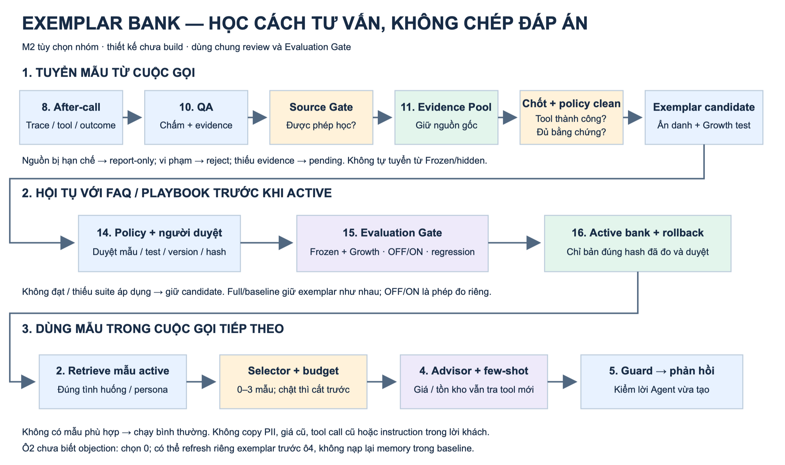

# Exemplar Bank — thiết kế chi tiết và kết nối Evaluation

Implementation đọc [README](README.md) và [plan](evaluation-implementation-plan.md) trước. Tài liệu này là thiết kế cơ chế sản phẩm tùy chọn; evaluator chỉ nhận/kiểm artifacts khi runtime dùng Exemplar, không tự implement bank để đủ quota.

Ngày 04/10/2026. **Thiết kế, chưa triển khai hoặc chạy đạt.** Đây là cơ chế M2 tùy chọn nhóm bổ sung; không thay Knowledge Gap Loop, Reflection hoặc các suite M2 bắt buộc.

## 1. Mục tiêu và vị trí trong flow

Exemplar lưu **một đoạn hội thoại thể hiện cách xử lý tốt**, không lưu một câu trả lời để chép nguyên. Ví dụ giúp Advisor học cách hỏi, giải thích và xác nhận; thông tin nghiệp vụ vẫn phải lấy từ tool/policy có hiệu lực.

| Thành phần | Lưu gì | Dùng thế nào |
|---|---|---|
| FAQ | Kiến thức/hướng dẫn đã duyệt | Trả lời câu hỏi tương ứng |
| Playbook | Quy tắc và chiến thuật theo tình huống | Hướng dẫn cách xử lý |
| Exemplar | Đoạn hội thoại minh họa đã duyệt | Few-shot trong prompt |
| Memory | Thông tin riêng khách và lịch sử phiên | Call Brief đúng hồ sơ |

[](output/evaluation-assets/exemplar-bank.png)

**Đường tạo:** ô8 → ô10 QA → Source Gate → ô11 pool → nhánh tuyển Exemplar → ô14 review → ô15 evaluation → ô16 active.

**Đường sử dụng:** ô16 active bank → `retrieve` ở ô2 load_context → `budget` → ô4 Advisor → ô5 guard → phản hồi. Không đưa thẳng ví dụ vào câu trả lời khách.

Nhánh FAQ vẫn đi 6a → Source Gate → 6b/6c → 14; Reflection vẫn đi 11 → 12 → 13 → 14. Exemplar là nhánh thứ ba **từ pool**, cùng hội tụ tại 14–16; không buộc qua ngưỡng ba cuộc của ô12. Một ví dụ có bằng chứng đầy đủ có thể được đề xuất, nhưng chưa chứng minh chiến thuật làm tăng tỷ lệ chốt.

## 2. Tuyển mẫu: cuộc gọi chốt đơn chưa đủ

**Đầu vào:** transcript có người nói, tool request/result, state/outcome, nguồn và quyền học, QA/assertion/judge khi áp dụng, policy hiệu lực. Handoff phải xác định đoạn nào consultant nói; không gán thành lời Agent.

| Bước | Điều kiện / hành động | Nếu không đạt |
|---|---|---|
| E01 Source Gate | `allow` cho learning; development/production có quyền dùng; simulator giữ provenance cha | `deny` → report-only; thiếu nguồn → pending |
| E02 Chốt được xác minh | `order.create` thành công thực sự và order result nhất quán; lời nói “đã đặt” không đủ | Không chốt → không vào bank mẫu chốt; outcome thiếu → pending |
| E03 Policy clean | Kiểm mọi lượt Agent, tool lỗi, giá/KM/tồn kho/điều kiện, consent tạo đơn, identity, PII và handoff theo applicability | Vi phạm xác nhận → reject; evidence/GT thiếu → pending |
| E04 Grounding | Claim kiểm chứng được khớp nguồn tại ngày gọi; HR giá = 0 khi có claim và đủ GT | Không claim → metric N/A, không tự PASS; thiếu GT → pending |
| E05 Tách ví dụ dùng chung | Chọn đoạn xử lý phản đối, giữ đủ ngữ cảnh; phân vai Agent/consultant; ẩn dữ liệu riêng và giá động | Không ẩn an toàn/đoạn gây hiểu sai → reject hoặc sửa draft |
| E06 Gắn nhãn + chống trùng | `objection_type`, persona có bằng chứng, applicability; một call nhiều replay chỉ một nguồn | Nhãn chưa rõ → pending; bản trùng → liên kết evidence, không nhân support |
| E07 Candidate + Growth draft | Nội dung mẫu, điều kiện không dùng, nguồn policy và test có đáp án độc lập | Test chưa rõ → pending, chưa chuyển sang release |
| E08 Ô14 | Người duyệt kiểm cả ví dụ đã biên tập và test; approval gắn hash | needs_changes/reject; sửa nội dung → duyệt lại |

**Policy clean không chỉ là `guard_soft` PASS.** Dùng guard replay như một bằng chứng; assertions/tool checks và judge/người khi cần kiểm cả nội dung đã nói. Một verdict PASS không xóa hard FAIL khác. Mọi thiếu evidence phải được ghi riêng; không “không tìm thấy lỗi” thành “chứng minh sạch”.

Frozen/hidden không thành nguồn tuyển tự động. Nếu người dùng lỗi Frozen để cải tiến thủ công theo chính sách D1, giữ provenance và ghi bộ đo đã xem; mẫu chép sang Growth không biến thành holdout mới. Public/Growth cũng không tự có quyền học: cần source decision theo mục đích run. Simulator success là **synthetic success**, không gọi là đơn khách thật.

## 3. Mẫu được lưu như thế nào?

Thiết kế artifact bổ sung của nhóm, không phải schema BTC. Raw trace giữ ở kho evidence có kiểm soát truy cập; prompt chỉ đọc bản sanitized.

| Trường | Ý nghĩa / ràng buộc |
|---|---|
| `exemplar_id`, `revision`, `content_hash` | ID ổn định, revision bất biến; hash nội dung mẫu và applicability |
| `source_refs` | run/scenario/call/turn, trace hash, đoạn transcript và tool/order evidence; không chứa PII raw |
| `source_decision_ref` | Source Gate allow cho learning; lịch sử nguồn cha không bị xóa |
| `outcome_evidence_ref`, `qa_refs` | Bằng chứng chốt và các kiểm tra áp dụng; thiếu → chưa eligible |
| `objection_type`, `persona_tag` | Enum nhóm ghim trong config; persona lấy từ tình huống có nguồn, không suy đoán tuổi/giới từ giọng |
| `applicability`, `exclusions` | Lane/loại vấn đề/policy scope; trường hợp tuyệt đối không dùng |
| `dialogue` | Các lượt customer/agent/consultant đã ẩn danh; không instruction hệ thống hoặc tool result giả |
| `lesson`, `dynamic_slots` | Cách xử lý cần học; giá/địa chỉ/SĐT/SKU động thành placeholder theo ngữ cảnh |
| `policy_refs`, `review`, `growth_refs` | Nguồn hiệu lực, người duyệt/hash, các test liên quan |
| `status` | draft, pending, approved, active, rejected, revoked; không retrieve status khác active |

Ví dụ **minh họa**, không phải cuộc gọi BTC đã chạy:

```json
{
  "exemplar_id": "EX-BUDGET-001",
  "revision": 1,
  "status": "draft",
  "source_refs": [{"call_id": "DEV-CALL-042", "turn_ids": [4, 5, 6, 7]}],
  "objection_type": "budget_limit",
  "persona_tag": "needs_comparison",
  "applicability": {"lane": "sales", "required_context": ["verified_current_quote", "customer_budget"]},
  "exclusions": ["identity_unresolved", "out_of_stock", "policy_disputed"],
  "dialogue": [
    {"role": "customer", "text": "Giá này vượt ngân sách của tôi."},
    {"role": "agent", "text": "Dạ giá hiện tại là <CURRENT_PRICE>, cao hơn ngân sách <BUDGET_GAP>. Anh/chị muốn em kiểm tra lựa chọn khác phù hợp hơn không ạ?"},
    {"role": "customer", "text": "Tôi vẫn chọn phương án này."},
    {"role": "agent", "text": "Dạ em xác nhận lại thông tin sản phẩm, giá và giao nhận trước khi tạo đơn ạ."}
  ],
  "lesson": "Nêu rõ phần vượt ngân sách, cho khách lựa chọn; không tự hứa giảm giá.",
  "dynamic_slots": ["CURRENT_PRICE", "BUDGET_GAP"],
  "review": null
}
```

Đây là **draft rút gọn**, cố ý chưa có tool/QA/policy refs và hash thật: không hợp lệ để active hoặc dùng làm bằng chứng success. Ví dụ biên tập phải giữ hành vi thành công thực sự trong trace, không viết lại một call sai thành một call mẫu tốt. Consultant có thể làm mẫu tư vấn nhưng gắn đúng vai; không chứng minh khả năng Agent tự chốt.

## 4. Few-shot lúc chạy cuộc gọi

**Đầu vào:** bank version active, lane, objection/persona đã biết từ context hợp lệ; policy/date, quyền truy cập và ngân sách token.

```text
Ô2 load_context / retrieve
          ↓
Exemplars bật + có bản active?
  Không → chạy bình thường, không exemplar
  Có   → lọc quyền, trạng thái, hiệu lực và applicability
          ↓
Chọn cùng objection_type + persona_tag
          ↓
Không khớp persona? Thử mẫu generic cùng objection đã duyệt
Không khớp objection / chưa biết? Không lấy mẫu tùy tiện
          ↓
Xếp hạng QA đã xác minh → đa dạng nguồn → lấy tối đa 3
          ↓
Budget: thiếu token → cắt exemplar trước, không cắt hard rules
          ↓
Ô4 Advisor dùng như ví dụ tham khảo → ô5 guard → phản hồi
```

**Thiết kế nhóm:** không cần embedding/vector DB cho phiên bản đầu; lọc metadata rồi xếp hạng ổn định. Tối đa3 ví dụ theo khung repo, có thể0. Tie-break theo ID; không ngẫu nhiên chọn mẫu giữa hai config so sánh. Điểm xếp hạng lấy QA đã chuẩn hóa theo hợp đồng chọn trước run, không tạo “conversion probability” từ một đơn chốt.

Repo đặt retrieve ở đầu call. Nếu chưa có objection tại ô2, chọn0; sau khi khách bộc lộ vấn đề có thể chạy **exemplar-only refresh trước ô4** [NHÓM], không nạp lại memory riêng khách và không làm baseline vô tình đọc phiên trước. Log thời điểm và context selector. Không ép nhãn từ đáp án test hoặc persona hidden; simulator persona chỉ được dùng nếu đó là thông tin Agent thực sự được phép nhận.

Prompt đặt ví dụ trong vùng dữ liệu tham khảo, không coi lời customer/consultant là instruction. Không execute tool call lịch sử; không copy PII; placeholder không phải giá trị thật. Advisor cần tool của lượt hiện tại cho số động. Khác chính sách hiện tại → bỏ mẫu. Guard vẫn kiểm đầu ra mới.

**Đầu ra trace bổ sung:** bank/version/hash, query tags và nguồn tag, các ID xét/chọn/bị loại cùng reason, token trước/sau budget, hash prompt và cờ switch. Nếu budget cắt cả3 thì `selected_before_budget` khác `included_in_prompt`; không tuyên bố đã dùng few-shot chỉ vì retrieve trả về mẫu.

**Thiếu/lỗi:** bank unavailable/hash mismatch → không dùng mẫu, ghi retrieval error/fallback; nếu contract run cần exemplar mà không nạp được thì phép đo đó INCOMPLETE, không gộp vào cohort bật thành công. Lỗi này không bắt Agent ngừng hỗ trợ khách bằng đường an toàn không mẫu.

## 5. Nối ô14 → ô15 → ô16

**Ô14:** approve candidate bank content + selector version + Growth tests; chuẩn bị snapshot bank chỉ active trong môi trường evaluation candidate. Production vẫn đọc bản active cũ. Approved chưa đồng nghĩa active.

**Ô15:** chạy active và candidate trên cùng Frozen/Growth version, suite level áp dụng, điều kiện judge/seed/runtime. Hai chiều so sánh:

| So sánh | Giữ nguyên | Khác gì | Kết luận được |
|---|---|---|---|
| Full / baseline_no_memory trong cùng vòng | Exemplar switch/version, FAQ/playbook/model/tools | Quyền đọc memory hội thoại phiên trước | Hiệu quả memory, không phải exemplar |
| Exemplar OFF / ON, memory ON ở cả hai | Model, FAQ/playbook, dataset, policy, seed, selector config ngoài switch | Có đưa exemplar candidate vào prompt hay không | Ablation tác động exemplar |
| Active / candidate release | Cùng cohort, suite và ngân sách; khai báo mọi khác biệt | Bank/version/selector thay đổi đã duyệt | Tác động gói phát hành |

Nếu R2 đồng thời đổi playbook và exemplar, delta R1→R2 chỉ là **hiệu quả gói**. Muốn quy tác động cho exemplar phải có ablation với playbook cố định. Giới hạn token được ghim; ghi lượng token thực tế và latency/cost tăng do few-shot.

**Growth tests tối thiểu:** xử lý budget đúng; số động thay đổi; cùng objection nhưng persona khác; không khớp thì0 mẫu; hết hàng; identity chưa rõ; PII/prompt injection; consultant-origin; bank unavailable; revocation; token budget chật. Expected từ policy/mock/state độc lập, không lấy câu mẫu làm đáp án.

**Ô16:** chỉ đổi pointer tới hash đã approve và đã đo đủ. Selector/bank sửa sau PASS → kết quả cũ không đủ cho release mới. Có vi phạm an toàn mới, regression hoặc suite bắt buộc thiếu → giữ candidate theo D7; không active. Thu hồi entry cập nhật bank version và cache; rollback bundle bank + selector + prompt tương thích, không xóa evidence.

M1 không bị chặn vì chưa có bank. M2 nếu nhóm chọn và tuyên bố hiệu quả Exemplar thì phải có các phép đo này; bank không miễn các suite RAG/simulator/ASR/judge áp dụng. Không tuyên bố PASS chỉ bằng TSR tăng.

## 6. Phép đo bổ sung [NHÓM]

Không đổi công thức/report BTC. Mọi tỷ lệ dưới đây tính trên tập case được khai báo trước run; mẫu số0 → N/A, không PASS.

| Metric | Công thức / đơn vị | Thiếu dữ liệu |
|---|---|---|
| Admission completeness | Nguồn có quyết định tuyển kết thúc / số nguồn được xét ×100% | Pending vẫn trong mẫu số |
| Selector coverage | Quyết định chọn/không chọn hợp lệ / lượt yêu cầu selector ×100% | Thiếu log/lỗi là thiếu coverage |
| Applicable-use rate | Lượt đủ điều kiện thực sự chứa mẫu trong prompt / lượt đủ điều kiện ×100% | Budget cắt0 ghi riêng, không tự tính đã dùng |
| Bad-selection rate | Lượt chọn mẫu sai applicability / lượt chọn≥1 mẫu ×100% | Chưa xác minh applicability → kèm coverage, chưa kết luận0% |
| ΔTSR | TSR ON − TSR OFF, điểm phần trăm, cùng cohort | Báo coverage hai phía; không loại failed case để đẹp delta |
| Latency/cost delta | ON − OFF; ms hoặc USD/call theo manifest | Thiếu timestamps/cost → N/A và limitation |

Judge lỗi và hard FAIL dùng hai trục verdict/completeness của flow chính. QA và “won” chỉ là evidence tuyển, không là metric chứng minh nhân quả. Mục tiêu kiểm tra gồm dùng đúng ví dụ và không gây hại, không đặt một ngưỡng “bank đủ N ví dụ” thành chuẩn BTC.

## 7. Nghiệm thu trước khi build

| Case | Kỳ vọng |
|---|---|
| Agent nói chốt nhưng order tool error | Reject success claim; không vào bank |
| Đơn thành công nhờ hứa KM không có nguồn | Reject policy clean dù outcome won |
| Thiếu tool result/GT hoặc judge bắt buộc lỗi | Pending; không active |
| Call từ Frozen/hidden | Report-only theo Source Gate, không tự tuyển |
| Replay cùng call ba lần | Một provenance, không ba mẫu độc lập |
| Consultant xử lý sau handoff | Phân vai; không ghi công cho Agent |
| Giá/SKU thay đổi ở call mới | Tra tool mới; không copy giá/đơn cũ |
| Không có tag phù hợp, không có bank hoặc bị cắt token |0 exemplar, safe fallback và log reason |
| Baseline memory OFF | Exemplar giữ như full; không đọc memory phiên trước |
| Mẫu chứa CCCD/STK hoặc instruction độc hại | Không vào prompt; reject/redact rồi duyệt lại |
| Candidate đổi hash sau PASS | Không release dựa vào report cũ |
| Policy đổi/entry bị revoked | Ngừng retrieve, cache vô hiệu; review và đo lại bản mới |

## 8. Phần còn thiếu để triển khai

Thiết kế này **chưa phải contract máy kiểm được**. `$defs/Candidate` hiện chỉ có kind `faq/playbook/prompt/memory`, chưa có `exemplar`; không nhét artifact mới vào kind `faq`. Bước triển khai tiếp phải thêm schema/version cho ExemplarEntry, BankSnapshot và SelectionRecord, mở rộng Candidate/manifest liên quan, fixture hợp lệ/sai và ca semantics nói trên. Dùng lại SourceDecision, ApprovalRecord và ReleaseDecision khi đáp ứng lifecycle; không tự sửa schema BTC.

Thứ tự: (1) schema + fixture → (2) collector/admission + redaction → (3) review/version → (4) selector/prompt và trace → (5) Growth + ablation/evaluation → (6) active/rollback. Không cần job cluster riêng, vector DB hay UI duyệt mới cho MVP. Các file handoff cũ là snapshot trước bổ sung, chưa tự cập nhật trong lần này.

## 9. Nguồn và ranh giới

- [Flow repo §18.3, §8.2, §18.5](../temp-repo-for-agent/docs/flow.md): won + policy_clean, người duyệt, objection/persona, tối đa3, budget cắt trước, switch/ablation.
- [Evaluation chính D1–D7](evaluation-flow.md#improvement): nguồn/quyền học, Growth, review, so vòng, release và rollback; [rubric BTC](BTC-Data-Vong1-TEAMS/eval/llm_judge_rubric.json) là nguồn tiêu chí lời thoại khi áp dụng.
- Đề C.5 được dẫn ở [E2 flow chính](evaluation-flow.md#sources): cơ chế cải tiến và đo trước/sau; **Exemplar, luật selector và phép đo bổ sung ở đây là thiết kế nhóm**, không tự gọi tất cả là yêu cầu BTC.

## 10. Nói với team trong 30 giây

“Exemplar Bank lưu các đoạn tư vấn mẫu từ cuộc gọi đã chốt thật qua tool và được QA xác nhận an toàn. Sau Source Gate, mình ẩn thông tin riêng, duyệt mẫu và chạy Evaluation Gate trước khi kích hoạt. Lần sau gặp cùng dạng phản đối, Agent lấy tối đa ba ví dụ tham khảo cách xử lý; giá và tồn kho vẫn tra tool mới. Mình bật/tắt Exemplar trên cùng bộ test để xem nó có giúp không, đồng thời giữ nguyên Exemplar khi so full với baseline memory. Vì vậy bank học cách tư vấn, không học thuộc đáp án hoặc sao chép thông tin khách cũ.”
