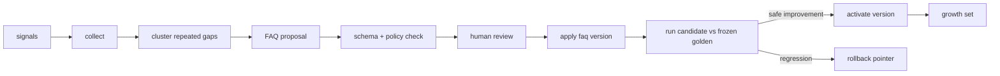

# Improvement mechanism research

## Decision

Start with the M1 Knowledge Gap Loop. Keep the loop human-approved, versioned,
measurable and reversible. Do not fine-tune the model or let a model publish a
production change by itself.

The current repository has no implementation for this loop. The design below
follows section 18 of `docs/flow.md` and is small enough to implement after the
evaluation contract exists.

## M1 flow



### Signal sources

Collect only redacted, attributable signals:

- out-of-scope questions and late out-of-scope failures;
- automatic evaluation failures from `errors.jsonl`;
- customer repetition signals such as “I already told you”;
- completed-call outcomes and reviewed QA failures.

Never mine a gap from the frozen golden set and then add the repaired case back
to that same set. New cases go to `growth`; golden remains measurement-only.

### Proposal lifecycle

Each proposal should carry:

```text
proposal_id, kind, cluster_label, examples, draft_answer,
source_signal_ids, status, author, reviewer, target_version
```

The lifecycle is `proposed -> checked -> approved -> applied`, with
`rejected` and `revoked` terminal states. The automatic check verifies schema,
forbidden promises, unsupported prices, privacy and policy conflicts. A QA or
consultant approves the customer-facing wording.

### Version and rollback rules

- `faq_v0` is the baseline; every apply creates `faq_v1`, `faq_v2`, etc.
- Store the version and content hash in the evaluation manifest.
- Evaluate the candidate on the frozen golden set before activation.
- A hard safety regression blocks activation regardless of average score.
- Rollback changes the active version pointer; it does not delete evidence.
- Add repaired scenarios to `growth`, never silently edit an existing golden case.

## M2 extension

Reflection now has a per-call lesson/no-change/pending design, and optional
offline strategy A/B has a separate protocol:
[Reflection and A/B design](../../../evaluation/reflection-ab-design.md).
The consolidated main flow is in [Evaluation A1/D9/D10](../../../evaluation/evaluation-flow.md).
These additions do not mean runtime jobs or new machine schemas are implemented.

Detailed Exemplar Bank design (04/10/2026):
[admission, retrieval, evaluation and release](../../../evaluation/exemplar-bank-design.md),
connected to [the main evaluation flow, D8](../../../evaluation/evaluation-flow.md#exemplar-bank).
This is a design extension, not an implemented mechanism. It reuses Source Gate,
review and release; machine schemas for the new exemplar artifacts are still pending.

After M1 is stable, add two consumers of the same signal/proposal/review
infrastructure:

- **Exemplar bank:** admit only calls that completed successfully and passed
  `policy_clean`; select by objection type and persona, then diversify.
- **Reflection/playbook:** record every call when this mechanism is enabled;
  only propose a lesson for meaningful evidence, otherwise record no-change
  or pending. Validate
  the lesson, review it, version individual playbook entries and support
  revocation.

Neither mechanism may bypass the reviewer or modify the production prompt
directly.

## Small implementation contract

The first implementation only needs these jobs and views:

1. `collect`: write redacted signals with source call and scenario IDs.
2. `cluster`: group repeated questions and rank by frequency and severity.
3. `propose`: create an FAQ draft from one cluster.
4. `review`: approve, reject or edit the draft.
5. `apply`: create an immutable version and add repaired cases to growth.
6. `compare`: run the candidate against the same manifest and report deltas.
7. `rollback`: move the active pointer to the previous approved version.

The first acceptance check is deliberately small: one repeated-gap cluster can
produce one approved FAQ version, the version can be measured, and a forced
regression can roll it back without changing the golden cases.
